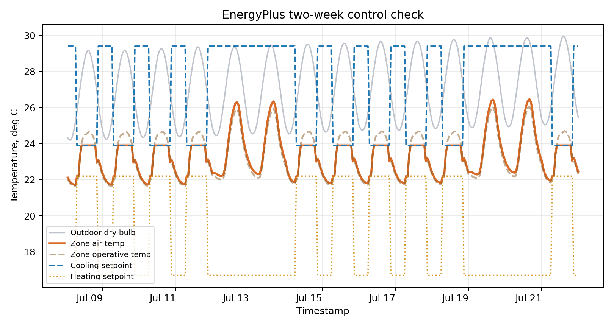

This kit gives A3 a runnable simulation route without making EnergyPlus installation the assignment.

Use it in two ways:

1. **Checked-output route:** inspect the provided CSV and chart.
2. **Local-run route:** install EnergyPlus and rerun the same two-week case.

The intellectual task is the same either way: draw a system boundary, read an hourly thermal sequence, set a threshold, and explain what the sequence can and cannot prove.

## Files

| File | Use |
|---|---|
| [`outputs/energyplus_two_week/monitored_outputs.csv`](outputs/energyplus_two_week/monitored_outputs.csv) | precomputed hourly state log |
| [`outputs/energyplus_two_week/monitored_outputs.png`](outputs/energyplus_two_week/monitored_outputs.png) | quick visual check of outdoor dry bulb, zone air temperature, operative temperature, and setpoints |
| [`outputs/energyplus_two_week/two_week_summary.txt`](outputs/energyplus_two_week/two_week_summary.txt) | run summary and extracted row count |
| [`a3_boundary_box_template.csv`](a3_boundary_box_template.csv) | fill-in template for the A3 system boundary |
| [`run_energyplus_two_week_case.py`](run_energyplus_two_week_case.py) | optional local runner that patches a stock IDF, generates a synthetic Hong Kong-like summer EPW, runs EnergyPlus, and extracts a compact CSV |

{fig-alt="Two-week EnergyPlus plot showing outdoor dry bulb, zone air temperature, operative temperature, heating setpoint, and cooling setpoint."}

## What This Demonstrates

EnergyPlus is used here as an exposure-state generator, not as proof of comfort.

The kit makes these assumptions inspectable:

| Boundary | Classroom choice |
|---|---|
| spatial | one selected zone from a stock EnergyPlus example model |
| temporal | July 8-21, hourly output |
| climate | synthetic Hong Kong-like summer EPW generated by the script |
| service | stock controlled model with heating and cooling thermostat setpoints |
| evidence | EnergyPlus stock IDF, generated weather, extracted CSV, and chart |
| limits | not calibrated, not a student building, not a compliance model, not a local airflow model |

## Variables To Inspect

| Variable | Design question |
|---|---|
| outdoor dry-bulb temperature | what weather sequence is driving the case? |
| zone mean air temperature | does the air condition exceed the selected threshold? |
| zone operative temperature | does the combined air/radiant condition change the body-facing claim? |
| cooling setpoint | what service target is the model trying to hold? |
| heating setpoint | is the model carrying a control assumption that matters? |
| cooling output, if present | where does the system mask or reveal thermal burden? |

## A3 Use

For A3, students can use the checked CSV directly.

Minimum A3 transformation:

1. choose a variable: air temperature, operative temperature, or another justified output;
2. declare a threshold;
3. count exceedance hours or degree-hours across the two-week window;
4. add the boundary table;
5. write a mechanism note explaining whether the pattern is driven by weather, service, storage, exposure, or model limits.

This is enough for a defensible temporal build-up audit. Rerunning EnergyPlus is optional.

## A4 Use

For A4, this kit can become a seed rather than a final answer.

Possible extensions:

- change the evaluation window;
- compare the checked CSV with a student-generated Honeybee or EnergyPlus export;
- hold the threshold fixed and test one design assumption;
- use the plot as a model-limit example when explaining why a studio project needs a different boundary.

The final claim must stay bounded. A stock model can teach exposure-state reasoning; it cannot prove a student's building performs.

## Optional Local Run

Install EnergyPlus from the [official EnergyPlus download page](https://energyplus.net/downloads) or from [NREL's GitHub releases](https://github.com/NREL/EnergyPlus/releases), then run:

```bash
python run_energyplus_two_week_case.py
```

If the executable is not on `PATH`, set `ENERGYPLUS_EXE`.

macOS:

```bash
export ENERGYPLUS_EXE="/Applications/EnergyPlus-25-1-0/energyplus"
python run_energyplus_two_week_case.py
```

Windows PowerShell:

```powershell
$env:ENERGYPLUS_EXE="C:\EnergyPlusV25-1-0\energyplus.exe"
python run_energyplus_two_week_case.py
```

The script looks for common stock IDFs such as `5ZoneAirCooled.idf`. If needed, set `ENERGYPLUS_IDF` to a stock IDF with real heating and cooling thermostat setpoints.

## Grasshopper / Honeybee Bridge

Students already working in Rhino/Grasshopper can treat the CSV as a handoff format:

- import the CSV into Grasshopper for visualization;
- reproduce the output route later through Honeybee/EnergyPlus;
- keep the exported data, weather window, zone name, and service state visible.

The bridge rule is simple: a parametric workflow becomes evidence only when the assumptions and exported outputs remain inspectable.
