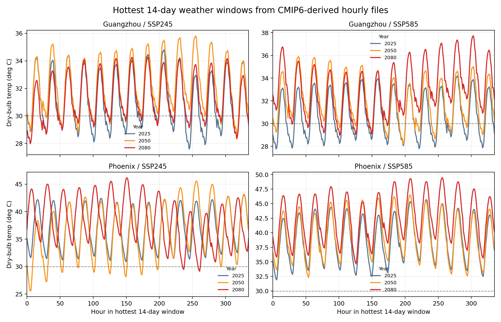
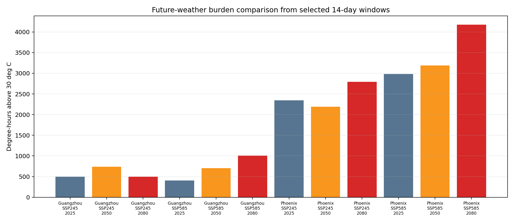

This kit gives Week 8, A3, and A4 a small future-facing weather artifact.

It does not ask students to become climate modelers. It gives them hourly weather windows they can inspect, plot, threshold, and compare.

## What It Contains

The source material is a local set of CMIP6-derived hourly forecast CSV files for two cities and two scenarios:

| City | Scenario |
|---|---|
| Guangzhou | SSP245 |
| Guangzhou | SSP585 |
| Phoenix | SSP245 |
| Phoenix | SSP585 |

For each city-scenario pair, the script selects the hottest 14-day dry-bulb window in 2025, 2050, and 2080.

## Files

| File | Use |
|---|---|
| [`outputs/future_weather_hot14_summary.csv`](outputs/future_weather_hot14_summary.csv) | compact comparison table for all city/scenario/year windows |
| [`outputs/future_weather_hot14_slices.csv`](outputs/future_weather_hot14_slices.csv) | combined hourly table for all 12 selected windows |
| [`outputs/slices/`](outputs/slices/) | individual city/scenario/year CSV windows |
| [`outputs/plots/future_weather_hot14_temp_profiles.png`](outputs/plots/future_weather_hot14_temp_profiles.png) | dry-bulb profiles for the selected 14-day windows |
| [`outputs/plots/future_weather_hot14_degree_hours.png`](outputs/plots/future_weather_hot14_degree_hours.png) | degree-hours above 30 deg C across windows |
| [`build_future_weather_windows.py`](build_future_weather_windows.py) | rebuild script for the local CMIP forecast CSV source |

{fig-alt="Line plots comparing hottest 14-day dry-bulb temperature profiles for Guangzhou and Phoenix under SSP245 and SSP585 in 2025, 2050, and 2080."}

{fig-alt="Bar chart comparing degree-hours above 30 degrees Celsius across city, scenario, and year."}

## How To Read It

The summary table includes:

| Column | Design reading |
|---|---|
| `mean_temp_C` | sustained background heat across the selected window |
| `max_temp_C` | peak dry-bulb severity |
| `hours_temp_ge_30C` | duration above a simple heat threshold |
| `degree_hours_above_30C` | accumulated thermal burden above the threshold |
| `hot_humid_hours_temp_ge_30C_RH_ge_60` | hours where heat and humidity combine |
| `hot_still_hours_temp_ge_30C_wind_le_1ms` | hours where air movement may be weak |
| `hot_sunny_hours_temp_ge_30C_GHI_ge_600` | hours where shade and solar control matter |

The threshold is deliberately simple. Students may change it, but they must explain why.

## A3 Use

Use this kit when A3 needs a changed weather, window, or climate snapshot.

Minimum A3 transformation:

1. choose one city/scenario/year slice;
2. plot temperature, RH, GHI, or wind speed across the 14-day window;
3. set a threshold;
4. calculate failure hours or degree-hours;
5. state what design mechanism the weather sequence stresses: night recovery, shade, moisture, air movement, or service load.

## A4 Use

For A4, this becomes a roll-forward check.

Possible claims:

- a shading strategy remains useful under a hotter future window;
- a passive ventilation claim weakens when wind is low during hot hours;
- a humidity-sensitive material or dehumidification claim needs a different boundary;
- a design action is robust in Guangzhou but not in Phoenix, or vice versa;
- a conclusion is **unsupported** because the future-weather slice is not a microclimate model.

The important move is not scenario quantity. It is whether the student can say how the design claim changes when the weather boundary changes.

## Rebuild

To rebuild from the local CMIP folders:

```bash
CMIP_SOURCE_ROOT="/path/to/CMIPs" python build_future_weather_windows.py
```

If `CMIP_SOURCE_ROOT` is not set, the script looks for the CMIP folder under the instructor's OneDrive-style path.

## Limits

These files are not EPWs and are not compliance weather files.

They are hourly weather windows for architectural stress testing. They are useful for questions about duration, burden, humidity, solar exposure, wind, and climate sensitivity. They do not directly prove courtyard microclimate, facade surface temperature, indoor comfort, or future climate certainty.

The windows are selected by hottest 14-day dry-bulb mean within each target year. Do not over-read one bar as a full probabilistic ranking of scenarios. Use the slices to ask how a design claim changes when the weather boundary changes.

## Grasshopper / Ladybug Bridge

Use the CSVs as a transparent handoff:

- import hourly columns into Grasshopper for plotting or geometry-linked annotation;
- use Ladybug/Honeybee weather workflows later if an EPW route is needed;
- keep the selected city, scenario, year, threshold, and weather variables visible.

The architectural standard is the same as the rest of the course: the tool matters less than whether the boundary and claim are inspectable.
