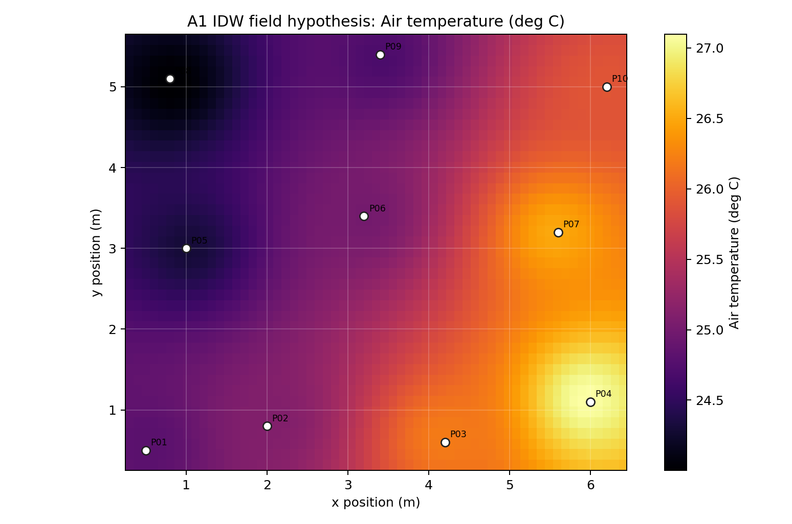
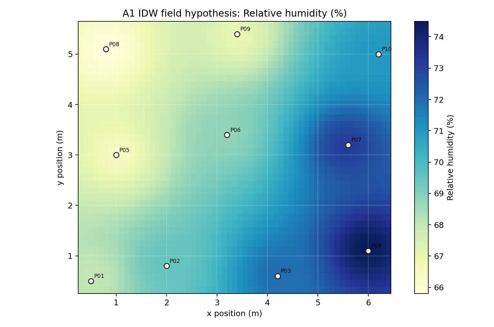

This kit fills the A1 spatial half of the course.

It turns sampled air temperature and relative humidity points into an interpolated field hypothesis, while keeping the measured points visible. The purpose is not to pretend the whole room was measured. The purpose is to make sampling, interpolation, and spatial uncertainty explicit.

## Files

| File | Use |
|---|---|
| [`sample_points.csv`](sample_points.csv) | editable A1 sample-point template |
| [`ta_rh_idw_notebook.py`](ta_rh_idw_notebook.py) | runnable notebook-style script |
| [`ta_rh_idw_notebook.ipynb`](ta_rh_idw_notebook.ipynb) | Jupyter wrapper for the same workflow |
| [`outputs/ta_rh_idw_grid.csv`](outputs/ta_rh_idw_grid.csv) | gridded `Ta/RH` field generated from the sample points |
| [`outputs/ta_rh_idw_summary.csv`](outputs/ta_rh_idw_summary.csv) | sample range, IDW settings, and leave-one-out error check |
| [`outputs/ta_field_idw.png`](outputs/ta_field_idw.png) | air-temperature field map |
| [`outputs/rh_field_idw.png`](outputs/rh_field_idw.png) | relative-humidity field map |

{fig-alt="IDW air-temperature field with original sample points visible."}

{fig-alt="IDW relative-humidity field with original sample points visible."}

## Run

From this folder:

```bash
python ta_rh_idw_notebook.py
```

Optional settings:

```bash
A1_POINTS_CSV="sample_points.csv" A1_IDW_POWER=2.0 python ta_rh_idw_notebook.py
```

## A1 Use

Minimum A1 transformation:

1. replace `sample_points.csv` with your measured or curated points;
2. run the notebook;
3. put the field map beside the original point map;
4. state the sensor protocol or data source;
5. state the interpolation limit.

## What To Claim

Acceptable A1 claims:

- the sampled field suggests a warmer facade-adjacent zone;
- RH and `Ta` do not necessarily peak at the same location;
- the sample layout is too weak to support a smooth field claim;
- a design decision should respond to a sampled gradient, not one room-average value.

Unacceptable claims:

- every location is known because the heat map is smooth;
- IDW proves a causal mechanism;
- CO2 or IAQ values replace the thermal field claim;
- the field is valid outside the sampled boundary.

## Grasshopper Bridge

Import `outputs/ta_rh_idw_grid.csv` into Grasshopper when students want geometry-linked visualization. The GH route should keep the original points visible and annotate the interpolation method.

The standard is simple: a field map is useful only when the sampling, interpolation, and uncertainty remain visible.
