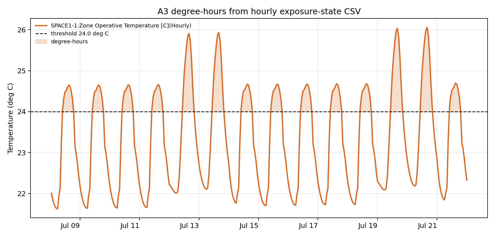

This kit makes the A3 degree-hours calculation explicit.

It ingests the checked EnergyPlus exposure-state CSV by default and calculates failure hours plus degree-hours above a chosen threshold. Students can then swap in a Honeybee export, measured logger file, future-weather slice, or spreadsheet-derived hourly table.

## Files

| File | Use |
|---|---|
| [`degree_hours_notebook.py`](degree_hours_notebook.py) | runnable notebook-style script |
| [`degree_hours_notebook.ipynb`](degree_hours_notebook.ipynb) | Jupyter wrapper for the same workflow |
| [`outputs/energyplus_degree_hours_summary.csv`](outputs/energyplus_degree_hours_summary.csv) | threshold, variable, failure hours, degree-hours, and peak value |
| [`outputs/energyplus_degree_hours_timeseries.csv`](outputs/energyplus_degree_hours_timeseries.csv) | hourly values with exceedance and degree-hour columns |
| [`outputs/energyplus_degree_hours_plot.png`](outputs/energyplus_degree_hours_plot.png) | plot showing the threshold and accumulated exceedance |

{fig-alt="Hourly operative temperature plot with threshold line and shaded degree-hours."}

## Run

From this folder:

```bash
python degree_hours_notebook.py
```

Optional settings:

```bash
A3_THRESHOLD_C=26 A3_VARIABLE_HINT=air python degree_hours_notebook.py
```

Use a different CSV:

```bash
A3_INPUT_CSV="/path/to/hourly_outputs.csv" A3_VARIABLE_HINT=operative python degree_hours_notebook.py
```

## A3 Use

Minimum A3 transformation:

1. choose the hourly variable: air temperature, operative temperature, outdoor temperature, or another justified field;
2. choose the threshold;
3. calculate failure hours;
4. calculate degree-hours;
5. explain what the accumulation means architecturally.

## Interpretation

Failure hours answer: how long is the condition beyond the line?

Degree-hours answer: how much burden accumulates above the line?

These are not comfort truth. They are threshold-based evidence. The A3 claim still needs a boundary table, a mechanism note, and a statement of what the hourly data does not include.
