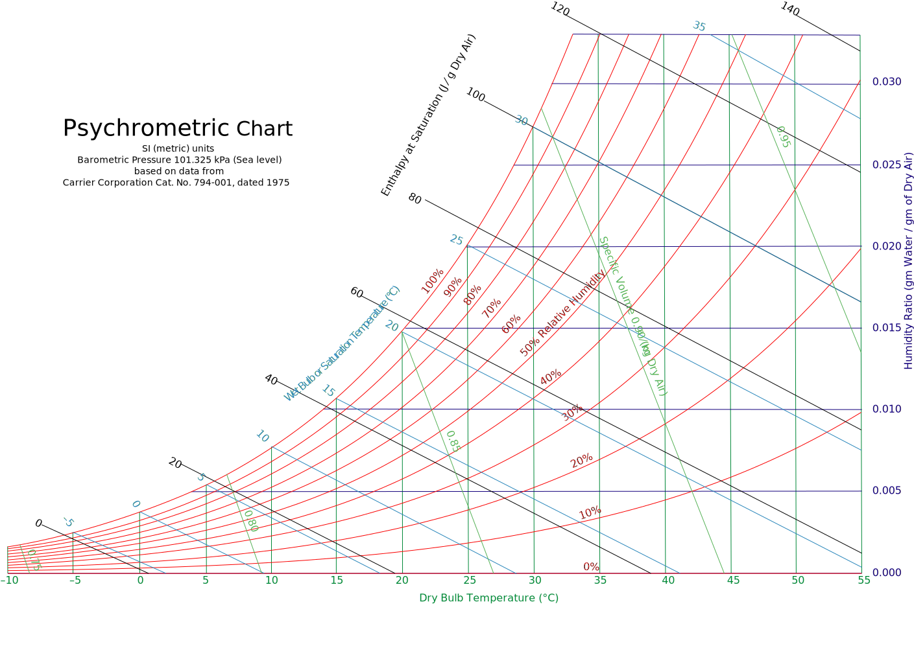
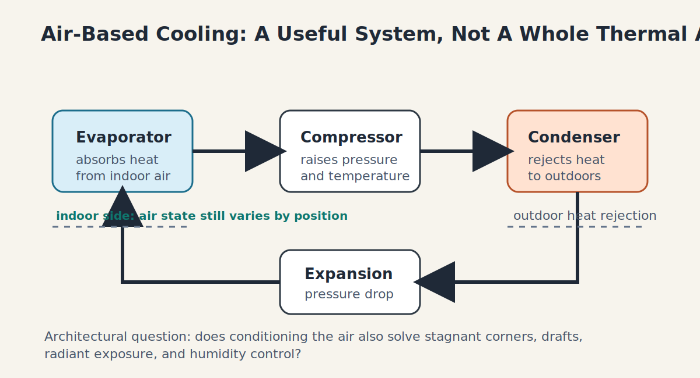
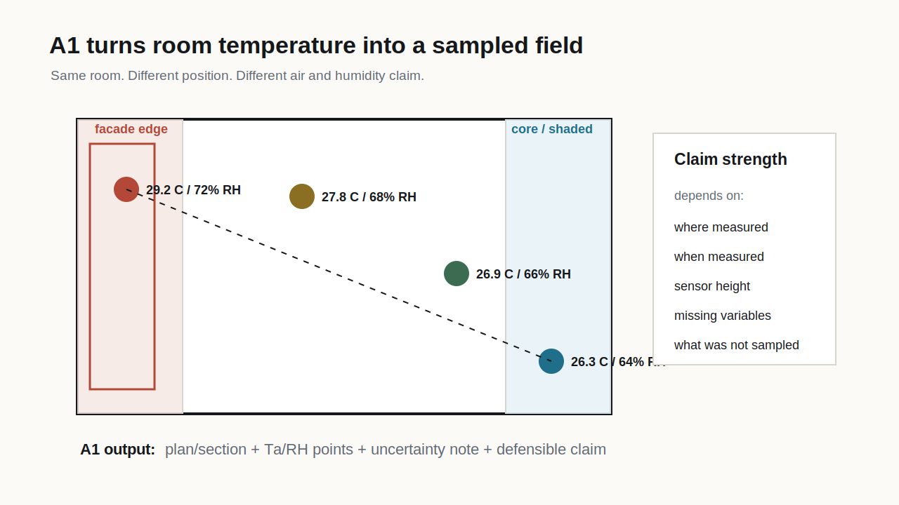
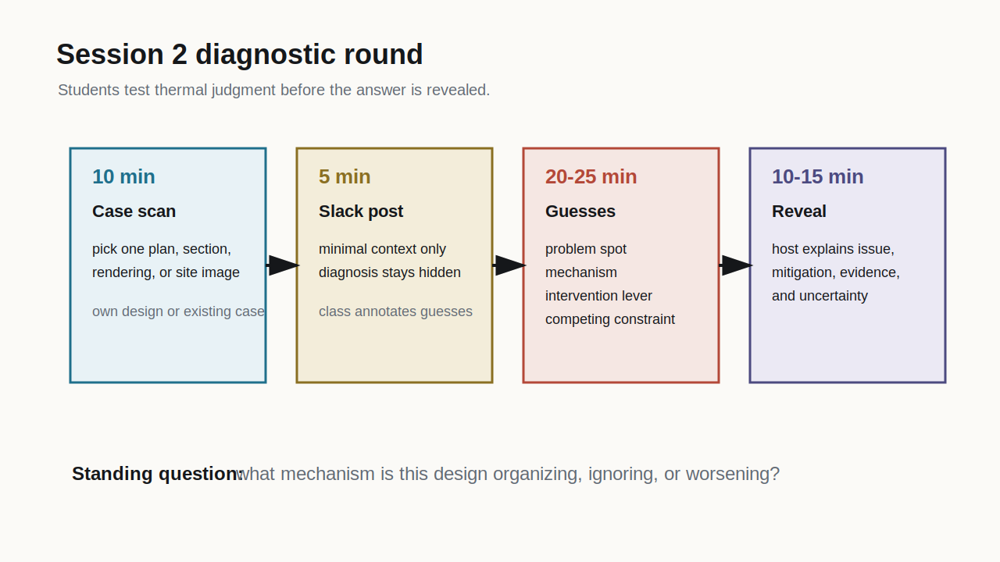

# Week 1

Thermal Fields in Architecture

**Air is not enough**

A1 launch spatial air field

## Full-Semester Build

::: {.progress-row}
::: {.active}
A1 spatial air field
:::
::: {}
A2 radiant exchange
:::
::: {}
A3 temporal build-up
:::
::: {}
A4 design action
:::
:::

::: {.key}
The course starts by asking students to distrust one-number thermal claims. A room is not thermally comfortable because one thermostat says so.
:::

## The First Question

**What does it mean to say a space is hot, cold, comfortable, stuffy, drafty, or risky?**

::: {.split}
::: {}
Common claim:

> "This studio is 24 C."

Thermal reasoning question:

> Which position, height, time, humidity state, air speed, ventilation context, exposure, body, and activity does that number represent?
:::

::: {.artifact}
**A1 output by Week 3**

Students make a spatial air field map with `Ta`, RH, air-movement observations, sampling points, an uncertainty note, one defensible claim, and one claim they cannot defend.
:::
:::

## Air Temperature Is A Sample

::: {.equation-card}
Spatial difference is already a thermal argument:

$$
\Delta T_a = T_{a,B} - T_{a,A}
$$

If `A` is the window seat and `B` is the shaded interior, the sign and magnitude of `\Delta T_a` tell us whether one room-temperature claim is hiding a spatial field.
:::

::: {.activity}
**Artifact move**

Draw a plan or section. Mark 3-5 positions. Give each position a `Ta` value, an RH value, and a time stamp.
:::

## From Points To Thermal Field

{.img-frame}

::: {.caption}
Course-authored contour example. The sampled points stay visible because the smooth field is an interpolation, not a direct measurement everywhere.
:::

## What A Field Map Adds

::: {.activity}
A point map answers:

> What did we measure here?

A field map asks:

> What spatial pattern might connect those measurements, and where does that pattern matter architecturally?
:::

::: {.warning}
Heat maps are powerful because they look certain. For A1, students must state whether a gradient is measured, interpolated, assumed, or only diagrammed.
:::

## Humidity Changes The Meaning Of Heat

::: {.split}
::: {}
Two locations can share the same air temperature but differ in evaporation potential.

In humid air, sweat evaporation is less effective. In dry air, the same `Ta` can feel different and can stress the body differently.
:::

::: {.equation-card}
Relative humidity:

$$
RH = 100 \times \frac{p_v}{p_{sat}(T_a)}
$$

`p_v` is water vapor pressure. `p_sat(T_a)` is saturation vapor pressure at the same air temperature.
:::
:::

## Psychrometric Reading

::: {.split-40}
::: {}
{.img-frame}

::: {.caption}
Psychrometric chart source: Wikimedia Commons.
:::
:::

::: {}
What this figure gives students:

- dry-bulb temperature as only one axis;
- relative humidity as a state relation, not decoration;
- wet-bulb and moisture content as signals of evaporative stress;
- a reason Hong Kong thermal claims cannot ignore humidity.

::: {.warning}
The point is not to memorize the chart in Week 1. The point is to see that air has more than one thermally relevant coordinate.
:::
:::
:::

## Air Has More Than One Coordinate

::: {.equation-card}
An air-based thermal claim needs more than dry-bulb temperature:

$$
\text{air state for design}
\approx
\left[T_a,\ RH,\ v_a,\ \text{ventilation context}\right]
$$

where `v_a` is local air speed at the occupied position.
:::

::: {.key}
Week 1 does not ask students to solve the whole airflow field. It asks them to stop pretending air temperature alone describes the condition.
:::

## Stagnant Air Is A Thermal Condition

Same `Ta`, same RH, different experience:

- air does not remove heat from the body effectively;
- sweat evaporation may feel weaker in humid air;
- moisture and odors can linger;
- a corner, alcove, deep plan, or blocked path can become a local pocket;
- the room average may look acceptable while the occupied position does not.

::: {.artifact}
For A1, students can mark air movement qualitatively: still, weak, noticeable, fan-driven, diffuser-driven, cross-flow, or draft-prone.
:::

## Air Movement Can Help Or Hurt

::: {.equation-card}
Convective heat exchange increases when air speed increases:

$$
q_{conv} \approx h_c(v_a)A(T_{skin}-T_a)
$$

`h_c` rises with air speed, but the consequence depends on air temperature, humidity, clothing, activity, and body location.
:::

::: {.warning}
Warm breeze can support cooling. Cold unwanted air movement can become draft discomfort. Air speed is not automatically good or bad.
:::

## Ventilation Is Not Cooling

Increasing outdoor air can improve perceived air quality and dilute pollutants.

It may also add:

- sensible heat load when outdoor air is hot;
- latent load when outdoor air is humid;
- local draft near openings or diffusers;
- uneven exposure if the airflow path bypasses occupied areas.

::: {.key}
Ventilation, air movement, cooling, and comfort overlap, but they are not the same design claim.
:::

## Air-Based Cooling Primer

{.img-frame}

::: {.caption}
Course-authored schematic. The cycle helps explain why many buildings start by conditioning air, while thermal experience still depends on humidity, air movement, surfaces, radiation, and position.
:::

## What AC Can Miss

::: {.cards-3}
::: {.example}
**Stagnant corner**

The system may condition return air while an occupied pocket remains weakly mixed.
:::

::: {.example}
**Draft path**

A diffuser or leakage path can overcool one body position while the room average looks normal.
:::

::: {.example}
**Radiant load**

Cool air may not remove one-sided heat from glass, sun, pavement, or warm surfaces.
:::
:::

::: {.activity}
Week 1 question: which of these is visible in your case image, and which would need measurement?
:::

## GH Bridge: Butterfly / OpenFOAM

If the design claim is about where air moves, [Butterfly / OpenFOAM](https://www.ladybug.tools/butterfly.html) can provide a Grasshopper bridge later.

::: {.equation-card}
`Rhino / GH geometry`

`-> Butterfly case setup`

`-> OpenFOAM solver`

`-> velocity / pressure field`

`-> occupied-zone interpretation`
:::

::: {.warning}
Butterfly is not a Week 1 requirement. It is a route for questions about stagnant pockets, drafts, courtyard flushing, fan effects, or opening strategies.
:::

## Butterfly Route: What Must Be Declared

Before trusting an airflow image, document:

- opening and inlet/outlet assumptions;
- boundary conditions;
- fan, heat source, or buoyancy assumptions;
- mesh and solver setup;
- where the body is located;
- what the model does not include.

::: {.key}
No boundary condition, no airflow claim. A beautiful CFD image is not evidence by itself.
:::

## Worked Example: Studio Perimeter

::: {.split}
::: {}
An architecture student says:

> "The desk near the curtain wall is always uncomfortable."

Possible readings:

- higher `Ta` near the facade;
- higher RH because air is stagnant;
- solar gain through glass;
- warm surface radiation;
- no air movement;
- draft from diffuser or leakage path;
- expectation or task duration.
:::

::: {.artifact}
**A1 only takes the first step.**

This week we do not solve the whole condition. We map whether the air, humidity, and air-movement field supports the claim.
:::
:::

## Hidden Defaults

| Default | What it hides | Architectural consequence |
|---|---|---|
| one room | perimeter/core, height, threshold, exterior edge | plan and section matter |
| one body | clothing, age, activity, sensitivity | occupant profile matters |
| one hour | morning, afternoon, heatwave, shoulder season | time matters |
| one sensor | placement, height, logging interval | evidence protocol matters |
| one air speed | stagnant pockets, drafts, bypass flow | ventilation path matters |
| one model | missing variables, calibration, weather assumptions | uncertainty matters |

## A1 Visual Grammar

{.img-frame}

::: {.caption}
Original course diagram. The map is intentionally simple: location plus `Ta/RH` plus claim limit.
:::

## Session 2: Diagnostic Round

{.img-frame}

::: {.caption}
The host reveals the diagnosis only after classmates make educated guesses.
:::

## Session 2 Timebox

::: {.round-steps}
::: {.round-step}
**10 min - case scan.** Choose your own studio project or an existing design. Use one plan, section, rendering, or site photo.
:::
::: {.round-step}
**5 min - Slack post.** Post the image with minimal context: project type, location or climate, and where the body might be.
:::
::: {.round-step}
**20-25 min - round-table guesses.** Classmates guess where `Ta/RH` may vary, why, and what design feature may already mitigate or worsen it.
:::
::: {.round-step}
**10-15 min - host reveal.** The host explains the actual concern, the evidence they have, the mitigation they believe exists, and what remains uncertain.
:::
:::

## Week 1 Hint Level

::: {.hint-card}
Hints are generous this week.

Guess using these lenses:

- facade edge, roof, floor, threshold, courtyard, shaded interior;
- high/low `Ta`;
- high/low RH;
- stagnant air pocket;
- sensor location that could mislead the claim.
:::

## Diagnostic Translation

::: {.activity}
The class is not judging whether the design is good or bad. The class is practicing thermal reading.

For every guess, name:

1. the suspected problem spot;
2. the mechanism;
3. the design feature that might help;
4. the competing constraint.
:::

## Exit Artifact

::: {.artifact}
Write a 4-line A1 seed:

1. My case image is...
2. The suspected `Ta/RH` difference is...
3. The design feature that may matter is...
4. The air-movement condition seems...
5. The claim I cannot yet defend is...
:::

## What Carries Forward

::: {.progress-row}
::: {.active}
A1 spatial air field
:::
::: {}
A2 radiant exchange
:::
::: {}
A3 temporal build-up
:::
::: {}
A4 design action
:::
:::

Next week: the body enters the diagram. Air and humidity matter because the body must exchange heat with a space.
