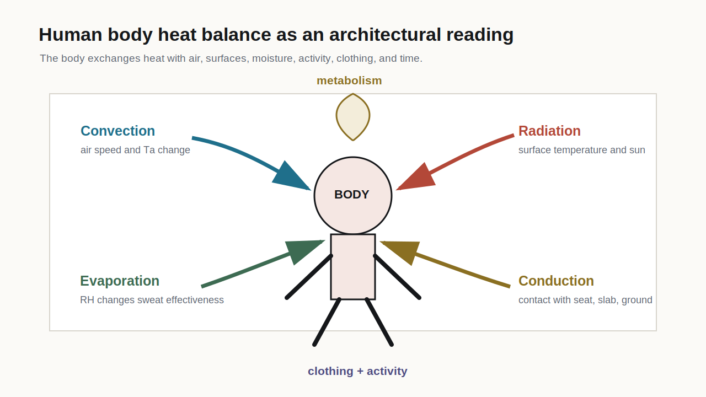
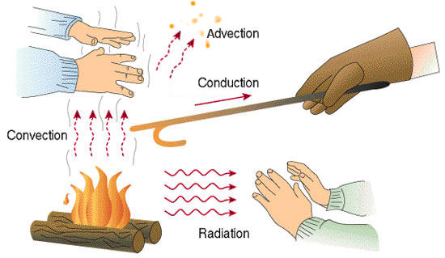
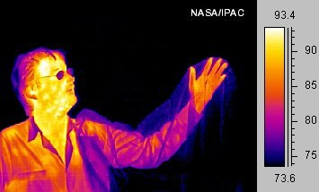
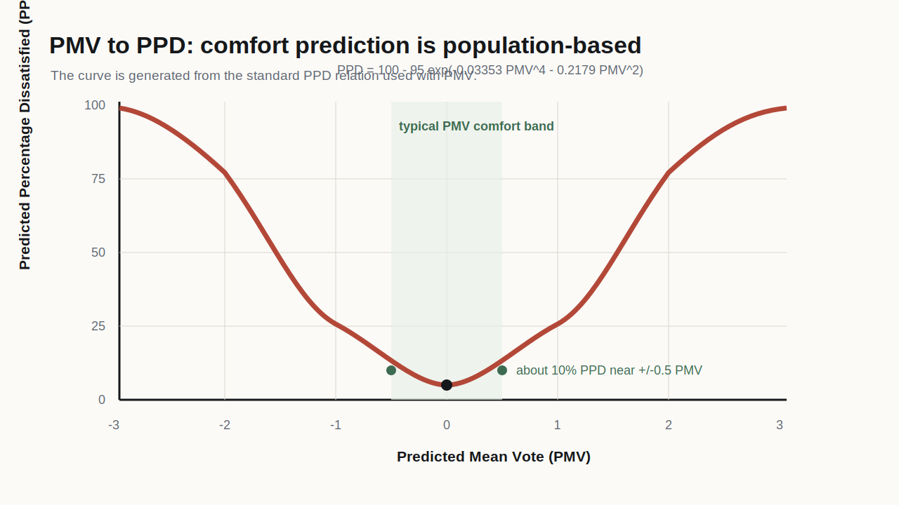
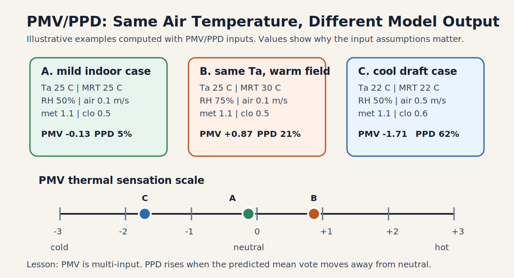
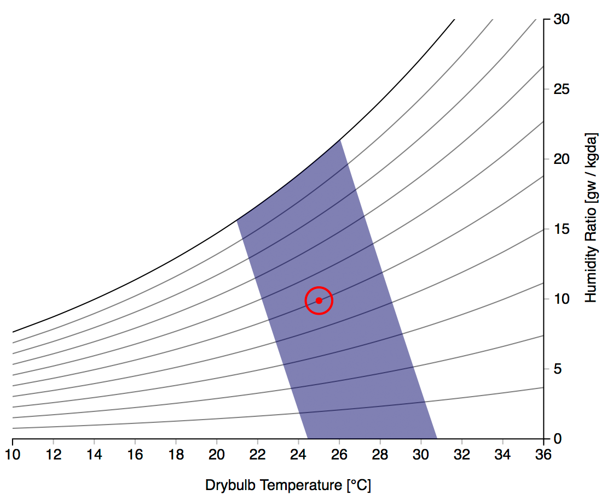
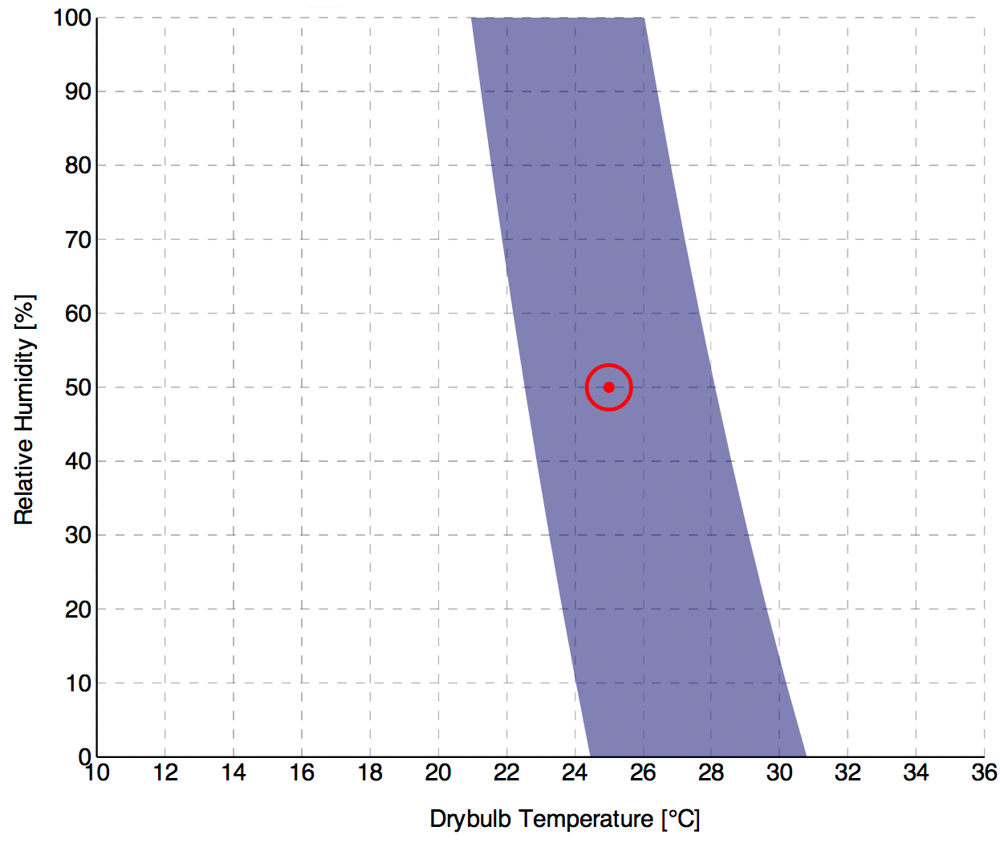
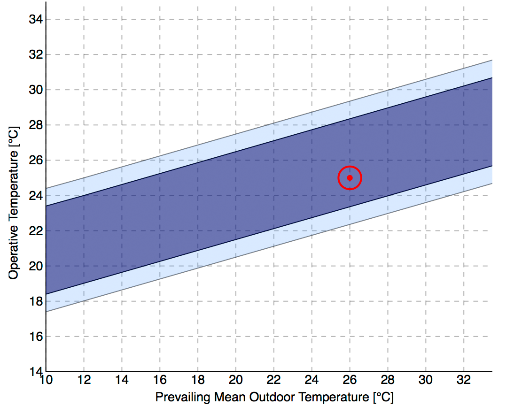
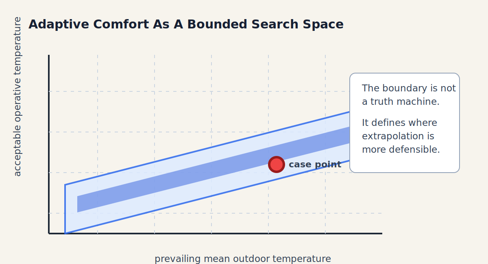

# Week 2

Body, surface, air, and moisture

**The body is the thermal receiver**

A1 support comfort models

## Where We Are

::: {.progress-row}
::: {.active}
A1 spatial air field
:::
::: {}
A2 radiant exchange
:::
::: {}
A3 temporal build-up
:::
::: {}
A4 design action
:::
:::

::: {.key}
Thermal comfort starts from heat balance: the body produces heat and must exchange it with the environment through air, radiation, evaporation, and contact.
:::

## Heat Balance Is Not Abstract

{.img-frame}

::: {.caption}
Original course diagram. The same body can read different spaces differently because the exchange pathways change.
:::

## The Small Equation That Organizes The Week

::: {.equation-card}
At a conceptual level:

$$
M - W = C + R + E + K + S
$$

where `M` is metabolic heat, `W` is external work, `C` is convection, `R` is radiation, `E` is evaporation, `K` is conduction, and `S` is body heat storage.
:::

::: {.warning}
For architecture students, the question is not "solve the full human physiology model." The question is "which exchange term is my design changing?"
:::

## Heat Transfer Modes

::: {.split}
::: {}
{.img-frame}

::: {.caption}
Downloaded reference figure: Wikimedia Commons.
:::
:::

::: {}
Architectural translations:

- **conduction**: contact with seat, floor, slab, envelope;
- **convection**: air speed, fan, downdraft, ventilation path;
- **radiation**: warm glass, cold window, sun patch, hot pavement;
- **evaporation**: humidity and sweat effectiveness.

The same modes appear in building physics, outdoor microclimate, and fire/tenability thinking.
:::
:::

## Air Speed Belongs To The Body Diagram

::: {.equation-card}
Air speed changes convection and evaporation at the body:

$$
C \sim h_c(v_a)(T_{skin}-T_a)
$$

$$
E \sim h_e(v_a)(p_{skin}-p_a)
$$

The exact coefficients can wait. The design consequence cannot.
:::

::: {.key}
Fans, openings, diffusers, shafts, and corridor pressure paths change the body heat balance even when the thermostat value stays the same.
:::

## Breeze, Draft, And Local Discomfort

Air movement is judged locally.

| Condition | Likely reading | Architectural lever |
|---|---|---|
| warm humid room + gentle fan | increased convective and evaporative relief | fan placement, air path, body position |
| cool room + diffuser aimed at neck/ankles | draft discomfort | diffuser direction, velocity, mixing, seating layout |
| open threshold + gusts | intermittent relief or irritation | screen, vestibule, canopy, operable control |
| stagnant corner | weak heat and odor removal | cross-flow path, fan assist, program relocation |

::: {.warning}
Do not call air speed "good" in general. Ask where it lands on the body, at what temperature, with what humidity, for how long.
:::

## Humidity, Evaporation, And Dehumidification

High humidity affects the body's cooling pathway because evaporation becomes less effective.

For buildings, this becomes a design and operation question:

- dehumidification can improve thermal tolerance without simply lowering `Ta`;
- very humid interiors can support mold risk and material damage;
- humid outdoor air can make ventilation costly or uncomfortable;
- dry air can also become a health and comfort problem in other climates.

::: {.activity}
For your A1 case, name whether the likely comfort issue is primarily air temperature, humidity, air movement, radiation, or an interaction.
:::

## Human Thermal Image

::: {.split}
::: {}
{.img-frame}

::: {.caption}
Downloaded reference figure: Wikimedia Commons.
:::
:::

::: {}
A thermal image reminds us that the body is not a single uniform node.

This matters for architecture because a window, wall, fan, floor, or shade device may affect one side of the body more than another.

::: {.example}
Window-seat discomfort can be local, asymmetric, and body-position dependent. A whole-room thermostat may miss it.
:::
:::
:::

## PMV/PPD As A Useful But Limited Model

::: {.equation-card}
The PPD relation often used with PMV is:

$$
PPD = 100 - 95e^{-0.03353PMV^4 - 0.2179PMV^2}
$$

It turns predicted mean vote into a predicted percentage dissatisfied.
:::

::: {.key}
The lesson is not that PMV is useless. The lesson is that every model has a domain, assumptions, and blind spots.
:::

## PMV Comfort Representations

::: {.split}
::: {}
{.img-frame}

::: {.caption}
Course-authored PPD curve generated from the standard PMV/PPD relation.
:::
:::

::: {}
PMV/PPD is a population-level prediction, not a certificate of individual experience.

The curve is useful because it makes one thing visible: even at predicted neutrality, some dissatisfaction remains. Thermal comfort is not a universal yes/no state.
:::
:::

## PMV/PPD Worked Cases

{.img-frame}

::: {.caption}
Course-authored examples computed with PMV/PPD inputs. They are illustrative, not a substitute for checking model assumptions.
:::

## How To Read The PMV Example

::: {.activity}
For each case, ask:

1. What changed besides air temperature?
2. Which heat-exchange term changed most?
3. Does PPD rise because the model predicts too warm, too cool, or both?
4. What would an architect change first?
:::

::: {.key}
PMV is not a single-temperature comfort calculator. It is a multi-input heat-balance model that turns declared assumptions into a population-level prediction.
:::

## GH Bridge: Ladybug Comfort Route

[Ladybug Tools](https://www.ladybug.tools/) gives Grasshopper/Rhino users a bridge into climate and comfort workflows.

For Week 2, the relevant workflow is:

::: {.equation-card}
`Ta + MRT + RH + air speed + met + clo`

`-> PMV / PPD or comfort map`

`-> discomfort hours, spatial comparison, or design alternative`
:::

::: {.warning}
The component can calculate quickly. It cannot choose the right input assumptions for you.
:::

## Ladybug Route: What To Export

If students use Ladybug Tools later, ask them to document:

- which comfort model or component they used;
- the source of `Ta`, MRT, RH, and air speed;
- metabolic rate and clothing assumptions;
- whether the case is indoor, outdoor, mixed-mode, or naturally ventilated;
- whether the output is point-in-time, annual hours, or a scenario comparison;
- what the model does not see.

::: {.artifact}
GH output only becomes course evidence when the input assumptions and model limits are visible.
:::

## PMV Comfort Zones

::: {.split}
::: {}
{.img-frame}

::: {.caption}
PMV psychrometric representation, Wikimedia Commons.
:::
:::

::: {}
{.img-frame}

::: {.caption}
PMV temperature-RH representation, Wikimedia Commons.
:::
:::
:::

## Thermal Comfort Is A Family Of Models

Different indices answer different questions.

::: {.key}
Do not ask one metric to do every job. Comfort, heat stress, outdoor exposure, occupational safety, and perceived stuffiness are related but not identical claims.
:::

## Common Metrics: Indoor Comfort

| Metric | Inputs it cares about | Typical use | Main caution |
|---|---|---|---|
| PMV / PPD | `Ta`, MRT, air speed, RH, metabolic rate, clothing | mechanically conditioned indoor comfort | population prediction, not individual truth |
| Adaptive comfort | prevailing outdoor temperature, operative temperature, adaptation context | naturally ventilated or mixed-mode comfort | valid only within defined model conditions |
| SET / two-node models | heat balance, clothing, activity, air, radiant, humidity | translating combined exposures to standard condition | stronger physiology assumptions |

::: {.caption}
These are comfort models, not full health-protection guarantees.
:::

## Common Metrics: Heat Stress And Outdoor Exposure

| Metric | Inputs it cares about | Typical use | Main caution |
|---|---|---|---|
| Heat Index / humidity index | air temperature + humidity | public hot-humid warning language | usually shade/light-wind assumptions |
| WBGT | wet bulb, globe temperature, dry bulb; sometimes workload | occupational, sports, heat-stress screening | screening index, not architectural diagnosis |
| UTCI | air temperature, wind, humidity, radiation, clothing/activity assumptions | outdoor biometeorology and urban climate comparison | complex model; still not a design answer alone |

::: {.warning}
Outdoor indices often contain radiation and wind more explicitly than indoor comfort shortcuts. That is why shaded streets and exposed plazas cannot be reduced to air temperature.
:::

## Standards And Reference Bodies

| Body / standard family | What it is commonly used for in this course |
|---|---|
| ASHRAE Standard 55 | indoor thermal environmental conditions for occupancy, including PMV and adaptive approaches |
| ISO 7730 | PMV/PPD and local thermal discomfort evaluation |
| ISO 7243 | WBGT-based heat stress assessment |
| National weather agencies | public heat-index or apparent-temperature warning systems |
| Occupational health agencies | workload, rest, hydration, exposure management, and heat-stress guidance |
| UTCI consortium / biometeorology community | outdoor thermal climate comparison and urban microclimate interpretation |

::: {.key}
The architect's job is to choose the index that matches the claim, then state what that index cannot see.
:::

## What The Model Requires

| Input | Architectural reading |
|---|---|
| air temperature | location, height, time, HVAC control |
| mean radiant temperature | surfaces, glass, sun, shade, material |
| air speed | fan, opening, diffuser, draft path, stagnant pocket |
| relative humidity | evaporative potential, latent stress, dehumidification |
| metabolic rate | activity, program, task |
| clothing insulation | season, culture, expectation, control |

::: {.warning}
If a student cannot state the input assumptions, they should not overstate the comfort claim.
:::

## Heat Exchange Is A Multi-Input Function

Each heat-transfer mode depends on more than one variable.

| Term | Simplified dependency | Design translation |
|---|---|---|
| convection `C` | `f(T_skin, T_a, v_a, clothing, posture)` | fan, diffuser, opening, body position |
| radiation `R` | `f(T_skin, T_mrt, surface temps, view factors)` | glass, shade, surface material, orientation |
| evaporation `E` | `f(RH, vapor pressure, air speed, sweating, clothing)` | dehumidification, ventilation, fan, activity |
| conduction `K` | `f(contact area, material, surface temp)` | seat, floor, handrail, slab, ground |
| storage `S` | `f(exposure duration, metabolism, heat loss)` | risk accumulates over time |

## What "Analytically Solved" Means Here

::: {.equation-card}
Given assumptions and inputs, the model computes a result from heat-balance logic:

$$
\text{comfort or stress output} = f(T_a,\ RH,\ v_a,\ T_{mrt},\ M,\ I_{cl},\ \text{time})
$$
:::

This is not a vibe score.

It is also not pure truth.

::: {.warning}
Analytical solution means the calculation follows declared equations and coefficients. The result is only as good as the inputs, domain, and assumptions.
:::

## Adaptive Comfort As A Boundary

{.img-frame}

::: {.caption}
Adaptive comfort chart source: Wikimedia Commons. The boundary links acceptable indoor operative temperature to prevailing outdoor temperature.
:::

## Adaptive Comfort As Search Space

{.img-frame}

::: {.key}
The adaptive zone is useful because it bounds the plausible search space. It says: within this domain, extrapolation is more meaningful; outside it, the claim needs a different model or stronger evidence.
:::

## Machine-Learning Analogy

::: {.equation-card}
Model output is reliable only inside a represented domain:

xcase &isin; Xtrained / validated / standardized

:::

For architecture:

- do not use PMV to answer every outdoor heat question;
- do not use adaptive comfort for sealed mechanically conditioned assumptions without care;
- do not use heat index to diagnose radiant asymmetry;
- do not use UTCI as a facade-detail answer without spatial translation.

::: {.activity}
For your case, name the metric you would start with and one reason it might be the wrong metric.
:::

## A1 Link: Better Sampling

::: {.activity}
**Upgrade last week's A1 seed**

For your chosen condition, add one body note:

1. What is the person doing?
2. How long are they there?
3. What clothing or expectation seems plausible?
4. Which heat-exchange term might dominate?
:::

::: {.artifact}
This does not turn A1 into a full comfort-model submission. It makes the air/humidity map more honest.
:::

## Session 2: Diagnostic Round

::: {.round-steps}
::: {.round-step}
**10 min - case scan.** Choose a design image where a body occupies a clear position: seat, desk, walkway, bed, bench, queue, or threshold.
:::
::: {.round-step}
**5 min - Slack post.** Post the image and identify only the body position. Keep your suspected thermal mechanism hidden.
:::
::: {.round-step}
**20-25 min - round-table guesses.** Classmates guess which heat-exchange pathway dominates and what design intervention would differ if another pathway dominated.
:::
::: {.round-step}
**10-15 min - host reveal.** The host clarifies their actual concern and names which pathway the design currently addresses or ignores.
:::
:::

## Week 2 Hint Level

::: {.hint-card}
Still generous.

Guess through the body:

- convection: air speed, fan, downdraft, still pocket;
- radiation: hot/cold surface, sun patch, glass, sky view;
- evaporation: humidity, sweat, dehumidification, clothing;
- conduction: floor, seat, wall contact;
- metabolism: activity and duration.
:::

## Diagnostic Translation

::: {.activity}
After the host reveal, sketch one body in the selected condition and label the dominant heat-exchange pathway.

Then name the architectural lever and the competing constraint.
:::

## Exit Artifact

::: {.artifact}
Complete this sentence:

> If `_____` dominates the body's heat exchange, the design response should change by `_____`, but the competing constraint is `_____`.
:::

## Carry Forward

Next week we ask whether our sensing protocol can actually support the claim.

::: {.key}
The first course skill is not running software. It is knowing what a thermal claim would need before it deserves confidence.
:::
