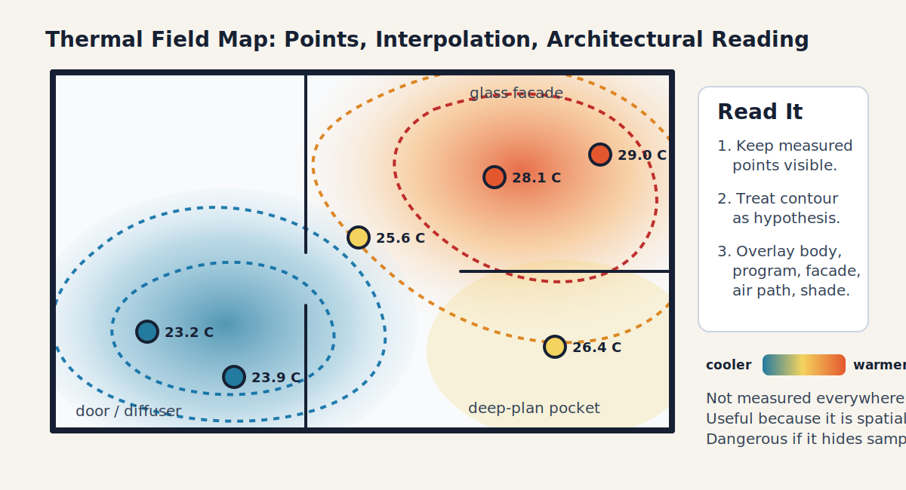

# Week 3

Environmental sensing and uncertainty

**A measurement is a design decision**

A1 due field protocol

## This Week's Job

::: {.progress-row}
::: {.active}
A1 spatial air field
:::
::: {}
A2 radiant exchange
:::
::: {}
A3 temporal build-up
:::
::: {}
A4 design action
:::
:::

::: {.key}
The sensor does not simply reveal the thermal field. Its location, height, interval, shielding, calibration, and missing variables shape the field we think we saw.
:::

## The Sensing Claim

::: {.split}
::: {}
Weak claim:

> "I measured the room and it was 27 C."

Architecturally useful claim:

> "At seated height, the facade-side desk was 1.8 C warmer and 6% RH higher than the interior desk between 14:00 and 15:00; I did not measure MRT or air speed."
:::

::: {.equation-card}
Spatial differential:

$$
\Delta T_a = T_{a,\text{facade}} - T_{a,\text{interior}}
$$

Humidity differential:

$$
\Delta RH = RH_{\text{facade}} - RH_{\text{interior}}
$$
:::
:::

## Sampling Bias Is Architectural

| Sampling choice | Bias introduced | Better question |
|---|---|---|
| one point | hides gradients | where is the body? |
| one hour | hides sequence | when is the claim true? |
| one height | hides stratification | breathing zone, ankle, head? |
| no surface reading | hides radiant difference | what is the body facing? |
| no air speed | hides convection | is there a path or stagnant pocket? |
| no occupant note | hides activity and expectation | who is the thermal subject? |

## Capturing RH Effectively And Ineffectively

Humidity evidence can look simple and still mislead.

| Practice | What it captures | What it may miss |
|---|---|---|
| one room RH reading | general air moisture at the sensor | facade/corner gradients, surface condensation, closets |
| Ta/RH pair at occupied height | local air state for a body | air speed, MRT, material moisture, sensor lag |
| dew-point check near cold surface | condensation plausibility | whether wetting persists long enough for damage |
| repeated transect | spatial pattern and repeatability | hidden cavities, maintenance behavior, episodic moisture |
| data logger over days | temporal build-up and drying | exact source of moisture or airflow path |

::: {.key}
For A1, RH is useful because it sits beside `Ta` and air movement. It is not a complete mold, material, or health diagnosis by itself.
:::

## From Samples To Contours

{.img-frame}

::: {.caption}
The contour map makes spatial relevance legible. It also makes uncertainty easier to hide if the sampled points disappear.
:::

## Interpolation Is A Claim

::: {.equation-card}
A field value between sensors is estimated:

Ta(x,y) &asymp; f(Ta,1, Ta,2, ..., Ta,n, x, y)

:::

Common routes:

- nearest sampled point;
- inverse-distance weighting;
- smoothed contour / heat map;
- manual diagram from a measured gradient.

::: {.warning}
Do not present a smooth contour as measured fact. Say how it was made and where the samples are sparse.
:::

## A1 Field Map Standard

::: {.checklist}
Minimum: measured or curated points on plan/section.

Stronger: contour or heat map with points still visible.

Best: contour plus architectural overlay: body position, program, facade, opening, diffuser, shade, or material.
:::

## Measuring Air Movement Is Harder Than Naming It

Air speed near a body can change quickly by position, height, posture, opening state, fan setting, and diffuser direction.

For A1-level evidence, acceptable descriptions include:

- measured air speed, if an anemometer is available;
- visible airflow cue, such as fan, diffuser, open window, door gap, curtain motion, smoke/string test if safe;
- qualitative label: stagnant, weak, noticeable, intermittent, draft-prone;
- position note: head, torso, ankle, seated height, standing height.

::: {.warning}
Do not average away airflow. A draft at ankle height and still air at face height are different occupied conditions.
:::

## Ventilation Rate Is Not Local Exposure

::: {.equation-card}
A useful ventilation intuition:

$$
\text{well ventilated room}
\not\Rightarrow
\text{well served occupied position}
$$

Air can short-circuit, bypass the body, stagnate in corners, or create a local draft.
:::

::: {.key}
This is why sensing locations are architectural choices. The question is not only "how much air enters?" but "where does it go, what does it carry, and who receives it?"
:::

## Perceived Air Quality And Thermal Comfort Can Split

Increasing outdoor air can make a space feel fresher by diluting odors and pollutants.

But the same move can:

- increase humidity load in Hong Kong;
- increase cooling energy demand;
- create local draft discomfort;
- move pollutants or heat toward another occupied position;
- improve perceived air quality while worsening thermal stress.

::: {.activity}
For your case, separate the claim into two lines: one about thermal condition and one about perceived air quality.
:::

## CO2 As A Competing Air Claim

CO2 is useful as an occupied-space ventilation proxy, but it is not a thermal comfort variable by itself.

::: {.equation-card}
A simple room concentration intuition:

$$
\frac{dC}{dt}
\approx
\frac{G}{V}
-
\lambda(C-C_{out})
$$

`G` is occupant generation, `V` is room volume, and `\lambda` is effective air exchange or removal.
:::

| Claim | What it says | What it does not prove |
|---|---|---|
| lower CO2 | more dilution or fewer occupants | good thermal comfort |
| higher air speed | stronger local convection / evaporation | enough fresh air |
| higher outdoor air | more ventilation potential | lower humidity load in Hong Kong |
| acceptable `Ta/RH` | air-state comfort may be plausible | good IAQ or low exposure |

::: {.key}
A1 can mention CO2 or IAQ if it matters to the case, but the assessed claim remains thermal: air, moisture, movement, body position, and evidence limits.
:::

## SMART-Style Radiant Sensing

::: {.split}
::: {}
The course can incorporate a SMART-style radiant sensing module when hardware is available.

The key architectural payoff is not the device itself. It is the ability to compare:

- air temperature;
- surface temperature;
- directional radiant signal;
- globe or MRT proxy;
- occupied position.
:::

::: {.warning}
Sensor sophistication does not remove uncertainty. Better sensors make uncertainty more visible and more specific.
:::
:::

## Indoor And Outdoor Are Linked

::: {.cards-3}
::: {.example}
**Indoor**

Facade-adjacent seat, studio corner, roof-exposed room, atrium edge.
:::

::: {.example}
**Threshold**

Corridor-door condition, lobby edge, shaded arcade, balcony.
:::

::: {.example}
**Outdoor**

Courtyard, walkway, bus stop, roof terrace, playground edge.
:::
:::

::: {.key}
Thermal fields cross architectural boundaries. A shaded threshold, ventilated lobby, or hot pavement can change the meaning of the adjacent room.
:::

## Ventilation Analogy

::: {.split}
::: {}
COVID-era ventilation debates made one thing obvious:

> one average room condition can hide local exposure.

Thermal sensing has the same warning. A well-mixed assumption may be useful, but it should be questioned near facades, atria, courtyards, doors, fans, and heat sources.
:::

::: {.equation-card}
Simple air-change intuition:

$$
\text{exposure} \neq \text{room average}
$$

The person occupies a position, not an abstract zone.
:::
:::

## A1 Submission Checklist

::: {.checklist}
Your A1 must include:

1. a plan or section with 3-5 sampling points;
2. `Ta` and RH values or a clearly labeled curated sample data set;
3. time stamp and sensor height;
4. air-movement observation or measurement note;
5. one point map, gradient map, marked differential, or clearly labeled contour/heat map;
6. field notes;
7. one defensible claim;
8. one claim you cannot defend yet.
:::

## Worked Example: Claim Limit

::: {.split}
::: {}
Defensible:

> The facade-side desk was warmer and more humid than the interior desk during this measured hour.

Not yet defensible:

> The facade design makes the studio thermally uncomfortable all semester.
:::

::: {.artifact}
The second statement may become defensible later, but only after radiant evidence, temporal evidence, and stress-window evidence are added.
:::
:::

## Session 2: Diagnostic Round

::: {.round-steps}
::: {.round-step}
**10 min - case scan.** Choose a design where sensing could become part of the design logic, not just a temporary survey.
:::
::: {.round-step}
**5 min - Slack post.** Post the image and state the use condition. Do not reveal where you would place sensors.
:::
::: {.round-step}
**20-25 min - round-table guesses.** Classmates guess where sensors should go, what they would miss, and what discipline would resist the sensor placement.
:::
::: {.round-step}
**10-15 min - host reveal.** The host explains the sensing protocol, what the design can accommodate, and what evidence would remain invisible.
:::
:::

## Week 3 Hint Level

::: {.hint-card}
Generous, but now tied to evidence quality.

Guess through these tensions:

- representative point versus occupied point;
- visible sensor versus integrated sensor;
- calibration and maintenance;
- privacy and trust;
- architectural finish, cost, and operations.
:::

## Diagnostic Translation

::: {.activity}
For one class guess, translate the sensor placement into a design decision:

- what it measures;
- what it misses;
- where it lives architecturally;
- which competing requirement could make it fail.
:::

## Exit Artifact

::: {.artifact}
Write a sensing statement:

> I would place sensors at `_____` because `_____`; the likely blind spot is `_____`.
:::

## Carry Forward

Next week we add surfaces, solar exposure, and mean radiant temperature.

::: {.key}
A1 gave us air and humidity. A2 asks what the body sees radiantly.
:::
