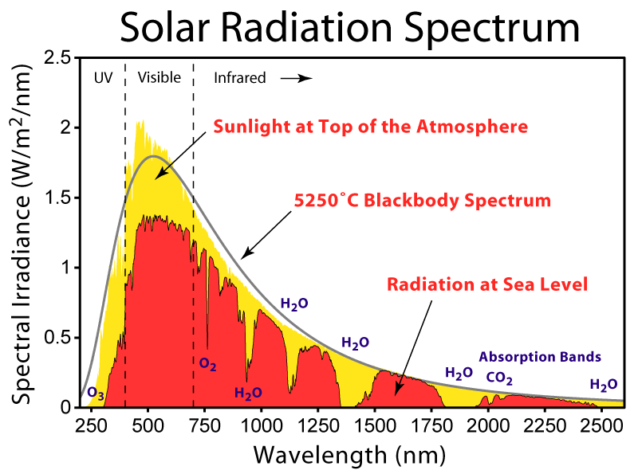
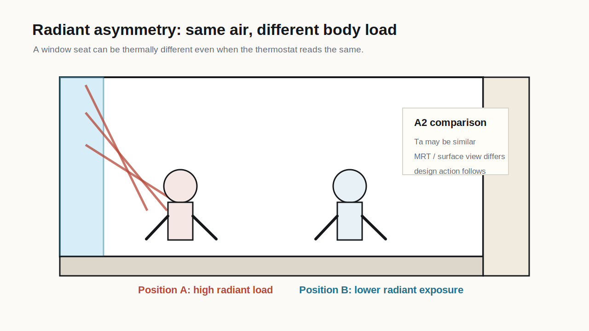

# Week 4

Radiant environment and MRT

**The body sees surfaces**

A2 launch

## Where We Are

::: {.progress-row}
::: {}
A1 spatial air field
:::
::: {.active}
A2 radiant exchange
:::
::: {}
A3 temporal build-up
:::
::: {}
A4 design action
:::
:::

::: {.key}
Two spaces can have the same air temperature and still be thermally different because the body's radiant exchange with surrounding surfaces is different.
:::

## From Air To Surroundings

::: {.split}
::: {}
Air temperature tells us about convective exchange.

Mean radiant temperature tells us about the radiant field surrounding the body.

Operative temperature gives a simplified combined reading of air and radiation.
:::

::: {.equation-card}
Simplified operative temperature:

$$
T_{op} \approx wT_a + (1-w)T_{mrt}
$$

When air speed is low, `T_a` and `T_mrt` often carry comparable weight.
:::
:::

## Mean Radiant Temperature

::: {.equation-card}
Conceptual definition:

$$
T_{mrt} = \text{uniform surrounding temperature producing the same radiant exchange}
$$

It compresses a complex surface field into one interpretable thermal coordinate.
:::

::: {.warning}
MRT is useful precisely because it is a compression. The architectural work is to remember what got compressed: surface temperatures, view factors, solar exposure, and body orientation.
:::

## Solar Radiation Has Wattage

Radiant design becomes concrete when students remember that sun and sky are heat sources and sinks, not just lighting conditions.

| Radiant term | Rough design reading | Architectural consequence |
|---|---|---|
| direct sun | can approach order-of-magnitude `800-1000 W/m2` under clear conditions | shade depth, canopy, orientation, body exposure |
| diffuse sky | lower but still spatially meaningful | sky view, courtyard proportion, cloudy humid days |
| reflected shortwave | depends on ground/facade reflectance | paving, facade finish, glare/heat tradeoff |
| longwave from hot surfaces | rises with surface temperature and view factor | material, storage, pavement, wall exposure |
| longwave to cool sky | potential heat sink, especially at night | sky view, roof exposure, night cooling |

::: {.key}
The numbers are not there for engineering precision in Week 4. They are there to stop "shade" and "surface" from being vague visual categories.
:::

## What Sunlight Contains

{.img-frame}

::: {.caption}
Solar radiation spectrum, Wikimedia Commons. The design point is simple: solar gain is not one visual phenomenon. Shortwave radiation, atmospheric absorption, glazing transmission, and surface absorption all shape what reaches the body or material.
:::

## Surface Properties Decide What Happens Next

The same solar wattage does not produce the same surface temperature on every material.

| Property | Design meaning | Architectural example |
|---|---|---|
| reflectivity / albedo | fraction of solar radiation sent away | light paving, cool roof, reflective facade |
| absorptivity | fraction of solar radiation absorbed as heat | dark stone, asphalt, dark metal panel |
| transmissivity | fraction passing through | glazing and translucent shading |
| emissivity | effectiveness of longwave radiation exchange | roof membrane, metal, glass, high-emissivity coating |
| thermal capacity | heat stored for later release | concrete, masonry, water, heavy ground |

:::{.equation-card}
For an opaque surface:

$$
\alpha + \rho \approx 1
$$

where `alpha` is absorptivity and `rho` is reflectivity.
:::

::: {.warning}
Color is a clue, not a full material model. The A2 question is what the surface absorbs, reflects, emits, stores, and exposes to the body.
:::

## Radiant Shift In Operative Temperature

When air speed is low, a change in MRT can move operative temperature substantially.

::: {.equation-card}
If

$$
T_{op} \approx 0.5T_a + 0.5T_{mrt}
$$

then a `6 C` MRT difference contributes roughly `3 C` to operative temperature.
:::

::: {.example}
An urban canyon can have similar air temperature at two ground-level positions while sun, shade, pavement, sky view, and facade reflection produce very different `T_{mrt}`.
:::

## Radiant Exchange Approximation

::: {.equation-card}
For a teaching-level design reading:

$$
q_{rad} \approx h_r A(T_{mrt} - T_{skin})
$$

or, for a surface-facing intuition:

$$
q_{rad} \approx h_r A(T_{surface} - T_{body})
$$

Longwave exchange depends on emissivity:

$$
q_{lw} \approx \epsilon \sigma A(T_s^4 - T_{sur}^4)
$$
:::

::: {.key}
The sign matters. Warm surroundings add radiant load; cold surroundings pull heat from the body.
:::

## Why Outdoors Is So Radiant

::: {.split}
::: {}
Outdoor thermal experience can be dominated by radiation because solar load, sky exposure, ground surface temperature, and shade quality change rapidly.

Air temperature may vary slowly. Radiant exposure can change when the body takes two steps.
:::

::: {.example}
Architectural objects:

- canopy depth;
- tree shade;
- pavement material;
- facade reflection;
- courtyard sky view;
- bench orientation.
:::
:::

## Solar And Sky In The Urban Canyon

At ground level, radiant environment can vary sharply across a few meters:

- sunlit pavement versus shaded pavement;
- high sky view versus narrow canyon;
- reflective facade versus absorptive facade;
- hot ground longwave versus vegetated edge;
- evening surfaces releasing stored heat after sun has moved.

::: {.warning}
Do not use air temperature alone to compare a shaded arcade, a sunlit crossing, and a narrow canyon. They may belong to the same weather file but not the same radiant field.
:::

## Week 4 Worked Case

{.img-frame}

::: {.caption}
Original course diagram. A2 compares two occupied positions rather than one room average.
:::

## A2 Prompt

::: {.activity}
Find or construct two positions where air temperature alone does not explain the thermal condition.

Good cases:

- window seat versus interior seat;
- shaded bench versus sunlit bench;
- glass facade perimeter versus deeper plan;
- concrete courtyard versus vegetated edge;
- roof terrace sun patch versus shaded threshold.
:::

::: {.artifact}
For each position, name the dominant radiant source or sink: direct sun, sky, hot surface, cool surface, reflected solar, or night-sky exposure.
:::

::: {.key}
Tool route for the first pass: [A2 Radiant Box Tool](../tools/radiant-box/index.html). Use it to compare two body positions, export a heatmap and CSV, then state what the rectangular proxy cannot prove.
:::

## What Counts As Radiant Evidence?

::: {.cards-3}
::: {.example}
**Direct**

globe temperature, radiant sensor, thermal camera, measured surface temperature.
:::

::: {.example}
**Proxy**

sun/shade map, surface material reading, solar exposure, facade orientation.
:::

::: {.example}
**Model**

Ladybug/Honeybee, EnergyPlus output, manual MRT estimate, annotated section.
:::
:::

::: {.warning}
Proxy evidence is acceptable if the student states what it can and cannot prove.
:::

## Session 2: Radiant Candidate

::: {.round-steps}
::: {.round-step}
**10 min - case scan.** Choose a plan, section, rendering, or site photo where air temperature is probably insufficient.
:::
::: {.round-step}
**5 min - Slack post.** Post the image with one body position. Keep the suspected radiant issue hidden.
:::
::: {.round-step}
**20-25 min - round-table guesses.** Classmates guess what the body sees radiantly: glass, sky, pavement, wall, canopy, sun, shade, or surface temperature.
:::
::: {.round-step}
**10-15 min - host reveal.** The host reveals the actual radiant concern, current mitigation, and what evidence would confirm or reject it.
:::
:::

## Week 4 Hint Level

::: {.hint-card thinner}
Hints become narrower.

Guess through:

- what surface occupies the body's view;
- whether the body faces or turns away from it;
- whether shade changes shortwave radiation or only visual glare;
- what surface temperature would have to be measured.
:::

## Diagnostic Translation

::: {.activity}
Convert one guess into an A2 comparison:

> Position A differs from position B because the body sees `_____` radiantly.
:::

## Exit Artifact

::: {.artifact}
Write your A2 comparison statement:

> I will compare position A and position B because air temperature alone misses `_____`.
:::

## Carry Forward

Next week we turn the radiant comparison into an exchange card: a compact artifact that links surface, body, flux, and architectural action.
