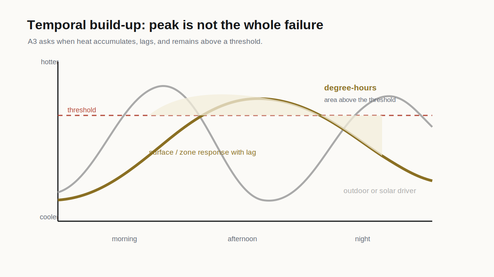

# Week 6

Thermal build-up, capacity, and integrals

**Failure can be cumulative**

A3 launch

## Where We Are

::: {.progress-row}
::: {}
A1 spatial air field
:::
::: {}
A2 radiant exchange
:::
::: {.active}
A3 temporal build-up
:::
::: {}
A4 design action
:::
:::

::: {.key}
A3 asks when the condition becomes problematic. The answer may be duration, lag, accumulation, or the hours after the visible heat source has passed.
:::

## Thermal Capacity

::: {.split}
::: {}
Heavy materials can absorb heat without immediately changing temperature. That can be useful or dangerous depending on the sequence.

Thermal mass may delay a peak, flatten a swing, or keep a space warm after the outdoor condition improves.
:::

::: {.equation-card}
Stored heat:

$$
Q = mc\Delta T
$$

`m` is mass, `c` is specific heat capacity, and `\Delta T` is temperature change.
:::
:::

## Conduction And Envelope

::: {.equation-card}
Simple conductive heat flow:

$$
\dot{Q} = UA\Delta T
$$

`U` describes thermal transmittance, `A` is area, and `\Delta T` is the temperature difference across the element.
:::

::: {.example}
Architectural use: compare roof, wall, window, exposed slab, or shaded facade as heat-flow pathways rather than decorative objects.
:::

## Dynamic Heat Balance

::: {.equation-card}
A simplified zone or surface balance:

$$
C\frac{dT}{dt} = \sum \dot{Q}_{gains} - \sum \dot{Q}_{losses}
$$

If gains exceed losses, the condition builds. If losses increase through night ventilation, shading, or material change, the trajectory can shift.
:::

::: {.key}
This is the equation behind many design decisions: shade reduces gains; insulation changes losses; mass changes the pace; ventilation changes removal.
:::

## Degree-Hours

::: {.split}
::: {}
{.img-frame}

::: {.caption}
Original course diagram. A peak temperature is not the same as accumulated burden.
:::
:::

::: {.equation-card}
Continuous version:

$$
DH = \int \max(T(t)-T_{thr},0)\,dt
$$

Student discrete version:

$$
DH \approx \sum_t \max(T_t-T_{thr},0)\Delta t
$$
:::
:::

## Fire Engineering Analogy

::: {.split}
::: {}
Fire engineering often treats safety as threshold plus time: smoke layer, heat release, tenability, exposure duration.

Thermal environmental design can use a gentler version of the same logic: exposure can become risky because it persists.
:::

::: {.warning}
This analogy is conceptual. We are not turning the course into fire engineering. We are borrowing the habit of thinking in thresholds, duration, and failure modes.
:::
:::

## A3 Prompt

::: {.activity}
Choose one condition from A1/A2 and ask:

1. What time period matters?
2. What threshold or target is relevant?
3. What variable will be plotted?
4. Does the issue come from peak, duration, lag, or accumulated exposure?
5. What design action might change the trajectory?
:::

## A3 Outputs

::: {.artifact}
Temporal Build-Up Audit:

- one time-series or sequence strip;
- one threshold line or target;
- one degree-hour, exceedance, or accumulated exposure calculation;
- explanation of build-up or lag mechanism;
- one failure statement;
- one candidate design action.
:::

## Pulse Check

::: {.activity}
Anonymous 5-minute course alignment check:

1. Is the course matching what you expected?
2. Which concept or tool route needs more support?
3. What is unclear about A2, A3, or A4?
4. What should be adjusted before the second half of semester?
:::

::: {.checklist}
The instructor will summarize one or two adjustments in Week 7.
:::

## Session 2: Diagnostic Round

::: {.round-steps}
::: {.round-step}
**10 min - case scan.** Choose a design where heat or moisture may accumulate, lag, or persist.
:::
::: {.round-step}
**5 min - Slack post.** Post the image and state the occupied period. Keep the suspected timing hidden.
:::
::: {.round-step}
**20-25 min - round-table guesses.** Classmates guess when the condition fails, whether the issue is peak, duration, lag, moisture build-up, or poor dissipation.
:::
::: {.round-step}
**10-15 min - host reveal.** The host explains the actual temporal concern, current mitigation, and likely threshold or time window.
:::
:::

## Week 6 Hint Level

::: {.hint-card thinner}
Moderate hints.

Guess through time:

- morning warm-up;
- afternoon solar gain;
- night cooling failure;
- surface or moisture storage;
- gusty versus reliable air movement;
- threshold duration rather than peak.
:::

## Diagnostic Translation

::: {.activity}
Build a four-frame storyboard from the host case:

1. starting condition;
2. heat or moisture gain;
3. delayed or accumulated response;
4. candidate design action.
:::

## Exit Artifact

::: {.artifact}
Write a one-sentence failure claim:

> The condition fails when `_____` remains above/below `_____` for `_____`.

This sentence will be tested with EnergyPlus outputs, measured data, curated data, or a simplified calculation in Weeks 7-8.
:::

## Carry Forward

Next week we introduce simulation outputs as structured hourly exposure states, not as truth or software certification.
