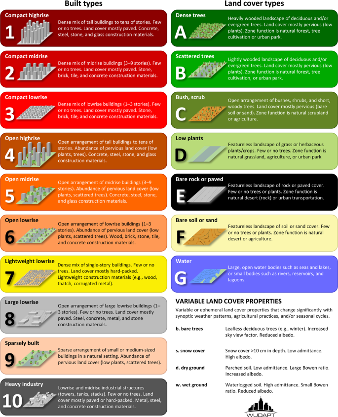
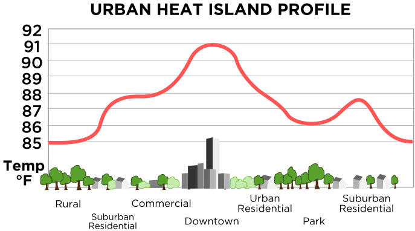
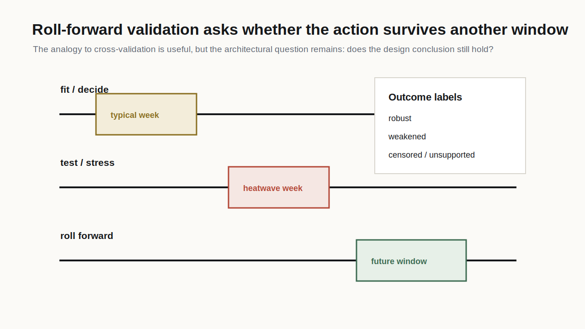

## Week Question

What happens when the weather file, exposure period, or boundary condition changes?

Week 8 uses weather as a stress-test input. The task is not to predict the future perfectly. The task is to show whether an A3 thermal claim depends on one convenient weather slice.

:::{.key}
One EPW or TMY file is a boundary condition, not the climate.
:::

## What An EPW File Gives You

An EPW file is an hourly weather sequence used by simulation tools.

Typical fields include:

- dry-bulb temperature
- dew point and relative humidity
- direct and diffuse solar radiation
- wind speed and direction
- sky condition and atmospheric indicators
- time stamp and location metadata

:::{.caption}
The same building model can produce different indoor exposure states when the weather boundary changes.
:::

## TMY Is Not An Extreme Year

A typical meteorological year is assembled to represent typical conditions. It is useful for many comparisons, but it can understate tail risk.

For A3 and A4, ask:

- Is the condition evaluated during a typical week, hot week, heatwave, or design period?
- Does the selected window include the relevant preheat or recovery period?
- Are solar radiation, humidity, and night cooling represented?
- Is the weather file being treated as evidence or as an unexamined default?

## Weather As Boundary Condition {.equation-card}

The outdoor state enters the model as a time sequence:

$$
x_t =
\left[
T_{db,t},
RH_t,
I_{dir,t},
I_{dif,t},
v_t,
\omega_t
\right]
$$

The indoor state is the response:

$$
s_t = f(x_t, B, O, S)
$$

Where $B$ is building assumptions, $O$ is occupancy, and $S$ is service or control state.

## From One Snapshot To A Climate Channel

Architecture is often taught through one time snapshot: a design day, a comfort target, a climate-zone label, or a sun-path moment.

For A3, use a temporal channel instead:

| Snapshot | What it represents | A3 use |
|---|---|---|
| historical / typical | baseline weather assumption | develop the initial failure claim |
| hot or humid stress window | sustained present-day stress | test tail-hour or recovery burden |
| future-adjusted window | shifted climate boundary | prepare A4 roll-forward validation |

:::{.equation-card}
The same design can be read through multiple climate snapshots:

$$
s_t^{(j)} = f(x_t^{(j)}, B, O, S)
\quad
j \in \{\text{historical},\ \text{stress},\ \text{future}\}
$$
:::

:::{.key}
The point is not to predict the future perfectly. The point is to stop pretending the historical snapshot is the only boundary condition architecture will face.
:::

## Climate Scenarios Without Overclaiming

Climate scenarios can enter the course through:

- a future or climate-adjusted EPW
- a hotter representative week
- a heatwave period
- a design-day or stress-period construction
- a GCM/RCM-derived weather product, if provided

Terms to keep straight:

- **GCM:** global climate model, coarse climate forcing.
- **RCM:** regional climate model, downscaled regional pattern.
- **WRF:** weather research and forecasting model; often used for higher-resolution weather or urban-climate studies when assumptions and boundary conditions are declared.
- **Weather file:** hourly sequence used by the building or microclimate analysis.

## Resolution Is Not Architectural Detail

Climate evidence arrives at different spatial scales.

| Evidence scale | What it can support | What it cannot directly prove |
|---|---|---|
| GCM grid | broad climate forcing and scenario logic | courtyard, facade, or street-canyon exposure |
| RCM / downscaled product | regional pattern and local climate tendency | exact microclimate at a bench or window seat |
| WRF / urban weather model | finer weather or urban-climate field, if set up well | comfort without body, material, and exposure assumptions |
| EPW / weather file | hourly boundary for building simulation | all future extremes or every local microclimate |
| field measurement | specific place and period | the whole climate or future condition |

:::{.warning}
A climate grid cell is not a room, courtyard, facade, or body. It becomes architectural evidence only after the system boundary and spatial translation are stated.
:::

## LCZ As Urban Climate Translation

Local Climate Zone (LCZ) language helps translate climate from "the city" to urban form and surface cover.

| LCZ question | Architectural reading |
|---|---|
| compact or open? | sky view, wind access, heat release |
| high-rise or low-rise? | canyon geometry, shading, longwave trapping |
| paved or vegetated? | surface temperature, evaporation, heat storage |
| heavy or lightweight surface stock? | thermal capacity and night-time release |
| anthropogenic heat present? | waste heat, traffic, equipment, dense occupancy |

:::{.key}
LCZ is not a replacement for site analysis. It is a useful middle scale between a regional weather file and the exact courtyard, roof, street, or facade that architecture changes.
:::

## LCZ Visual Vocabulary

{.img-frame}

::: {.caption}
Local Climate Zone classes from WUDAPT / Demuzere et al. The design reading is morphology plus surface cover: compactness, height, vegetation, paving, material stock, and anthropogenic heat.
:::

## Climate Zones Can Drift

Climate-zone labels are useful shorthand, but they can become dangerous defaults if treated as permanent.

Architectural questions:

- Is the project designed for a historical climate category that is shifting?
- Does the future condition become more hot-humid, less night-cooling-friendly, or more extreme in tail periods?
- Which passive strategy weakens when the climate-zone assumption drifts?
- Which design feature creates choice or refuge across multiple future states?

:::{.key}
For architecture, climate-zone drift matters because it changes which defaults remain defensible: ventilation, shade, thermal mass, glazing, refuge, drainage, and control access.
:::

## UHI As Night-Time Recovery Problem

{.img-frame}

::: {.caption}
Urban heat island profile, Wikimedia Commons. For this course, UHI is not only "the city is hotter." It is a recovery problem: surface storage, sky view, wind, waste heat, and night-time longwave loss determine whether heat leaves.
:::

## Sustained Climate Situations

Do not only ask for the hottest hour.

Look for situations that architecture has to endure:

- hot nights that prevent recovery;
- humid heat that weakens evaporative cooling;
- low wind that makes air movement unreliable;
- cloudy humid periods with poor drying;
- heatwave duration rather than peak temperature;
- future windows where present-day thresholds are crossed more often.

:::{.artifact}
A3 can use a simple pair: baseline window plus one changed climate or stress snapshot. A4 can later ask whether the selected action still holds.
:::

## Indoor/Outdoor Continuity

Indoor and outdoor stress tests share the same logic:

| Indoor condition | Outdoor or threshold analogue |
|---|---|
| roof-exposed room | roof terrace or top-floor walkway |
| glass perimeter | sun-exposed bench or facade edge |
| night cooling failure | courtyard heat retention |
| mixed-mode classroom | shaded threshold with weak air movement |
| humidity burden | low evaporative cooling potential |

The variables differ, but the question is the same: what exposure does the body receive over time?

## Stress-Test Comparison {.equation-card}

Compute degree-hours for the same condition under two weather or exposure assumptions:

$$
DH_{\theta}(W, E)
=
\sum_{t \in W}
\max \left(T_t(E) - T_{\theta}, 0 \right)\Delta t
$$

Where:

- $W$ is the weather or time window
- $E$ is the exposure or model assumption
- $T_t$ is the chosen state variable, such as $T_{op,t}$ or $T_{a,t}$

## Failure Hours {.equation-card}

Failure hours count duration beyond a threshold:

$$
FH_{\theta}
=
\sum_{t \in W}
\mathbf{1}\left[T_t > T_{\theta}\right]\Delta t
$$

Use both metrics when useful:

- failure hours show duration
- degree-hours show accumulated burden above the line
- maximum temperature shows peak severity but not persistence

## Weather-Window Cross-Validation

{fig-alt="Diagram comparing thermal conclusions across typical, hot, and heatwave weather windows" width="82%"}

:::{.caption}
The analogy is simple: do not tune the design claim to only one slice of weather. Check whether the conclusion survives another stress window.
:::

## Simple Cross-Validation Analogy {.equation-card}

The A4 version will come later, but the logic begins in A3:

$$
\text{develop on } W_1:
\quad
\text{interpret } DH_{\theta}(W_1)
$$

$$
\text{check on } W_2:
\quad
\text{compare } DH_{\theta}(W_2)
\text{ and } FH_{\theta}(W_2)
$$

This is not machine learning. It is a disciplined way to avoid overclaiming from one selected window.

## Stress-Test Matrix

Use a small comparison, not a scenario catalog.

| Keep fixed | Change one item | Report |
|---|---|---|
| zone model | typical week to hot week | change in degree-hours |
| shade condition | weather file | change in failure hours |
| outdoor position | sun exposure window | change in maximum and duration |
| occupancy schedule | heatwave length | change in tail burden |
| threshold | indoor/outdoor boundary | whether the claim still holds |

:::{.checklist}
If more than one assumption changes, say so. Do not hide a moving target.
:::

## Lab Activity: Stress-Test Memo {.activity}

Run or inspect a two-case stress test for the same condition.

**Artifact:** a one-page A3 stress-test memo with two time-series plots or one paired plot, a degree-hour or failure-hour table, and a sentence naming the changed weather, window, or exposure assumption.

**A3 mapping:** this memo is the Week 8 development layer for the Temporal Build-Up Audit. It shows whether the A3 failure statement is stable or dependent on one weather slice.

## Lab Activity: Boundary Explanation {.activity}

Write a boundary explanation for the stress-test memo.

**Artifact:** a five-row table listing spatial boundary, weather file or window, modeled service state, occupancy or exposure schedule, and the variable used for threshold evaluation.

**A3 mapping:** this table defines the assumptions behind the A3 degree-hour or failure-hour comparison. It also becomes the first draft of the A4 roll-forward validation assumption.

## Session 2: Diagnostic Round

::: {.round-steps}
::: {.round-step}
**10 min - case scan.** Choose a design condition whose conclusion may change under a different weather, exposure, or occupancy window.
:::
::: {.round-step}
**5 min - Slack post.** Post the image and baseline claim. Keep the stress window you worry about hidden.
:::
::: {.round-step}
**20-25 min - round-table guesses.** Classmates guess which changed weather or stress assumption could reverse, amplify, or weaken the claim.
:::
::: {.round-step}
**10-15 min - host reveal.** The host reveals the stress window and identifies whether the claim is stable, amplified, shifted, masked, or unsupported.
:::
:::

## Week 8 Hint Level

::: {.hint-card thinner}
Hints are now about uncertainty, not answers.

Guess:

- typical week versus heatwave;
- dry-hot versus humid-hot;
- short stress window versus long window;
- current EPW versus future-adjusted EPW;
- indoor boundary versus outdoor exposure.
:::

## Interpreting A Changed Result

Use precise labels:

- **stable:** the threshold conclusion is similar in both windows
- **amplified:** the hotter or longer window increases burden
- **shifted:** failure moves to a different hour or surface condition
- **masked:** service or schedule hides an underlying exposure
- **unsupported:** the evidence cannot support the comparison

:::{.key}
A changed result is useful. It tells you which assumption the design claim depends on.
:::

## Week 8 Exit Ticket {.checklist}

Before Week 9, each student should have:

- one baseline A3 window
- one changed weather, window, or exposure assumption
- a degree-hour or failure-hour comparison
- one sentence explaining why the result changed or did not change
- one candidate design target for the inverse ladder

Week 9 asks the inverse question: what intervention reaches the target?
