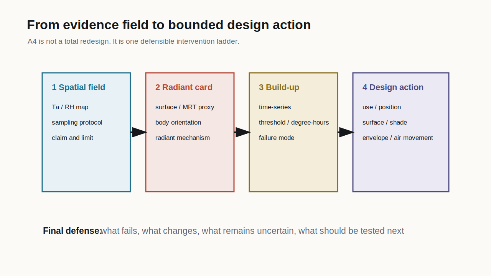

## Week Question

Instead of asking only "How does this design perform?", ask:

:::{.key}
What intervention is sufficient to reach the target, and what happens if the tested ladder cannot reach it?
:::

Week 9 closes A3 and launches A4 by converting temporal failure evidence into a bounded design action ladder.

## Forward Versus Inverse

Forward question:

- Given a design, what exposure state does it produce?

Inverse question:

- Given a target, what action is needed to reach it?

For this course, inverse work is not global optimization. It is a disciplined ladder of design actions that can be inspected and defended.

## Define The Target First

An action ladder is meaningless without a target.

Targets may be:

- maximum $T_{op}$ below a chosen line
- degree-hours below an A3 threshold
- failure hours reduced below a limit
- radiant asymmetry reduced at an occupied position
- humidity or air movement condition improved enough to support the claim

:::{.checklist}
The target must name the variable, threshold, time window, and occupied condition.
:::

## Action Space

The required ladder has a maximum of three levels:

1. **Use or position action:** move the body, change schedule, change activity, provide refuge, or change control access.
2. **Spatial or surface action:** shade, material, vegetation, facade depth, surface exposure, or program placement.
3. **Envelope, air movement, or system action:** glazing, insulation, ventilation, fan, mixed-mode rule, setpoint, or control change.

The ladder is small because the goal is a defensible action, not exhaustive optimization.

## Field To Action Ladder

{fig-alt="Diagram linking field evidence to use, surface, envelope, and system action levels" width="82%"}

:::{.caption}
The ladder should preserve the evidence chain: spatial field, radiant mechanism, temporal burden, design action.
:::

## Found And Censored Logic {.equation-card}

Let the tested action ladder be:

$$
\mathcal{A} = \{a_0, a_1, a_2, \ldots, a_k\}
$$

Let the residual burden for each action be:

$$
D_i = DH_{\theta}(a_i)
$$

The first found action is:

$$
i^* =
\min \left\{ i : D_i \le D_{target} \right\}
$$

## Found, Censored, Unresolved {.equation-card}

Use three possible outcome labels:

$$
\text{found}
\Longleftrightarrow
\exists i \in \{0,\ldots,k\}
\text{ such that }
D_i \le D_{target}
$$

$$
\text{censored}
\Longleftrightarrow
\forall i \in \{0,\ldots,k\},
D_i > D_{target}
$$

$$
\text{unresolved}
\Longleftrightarrow
\text{the evidence is insufficient to classify the ladder}
$$

## Why Censored Is Valid

A censored result is not a failed student project.

It can be a rigorous finding:

- the target was explicit
- the ladder boundary was explicit
- every tested action remained insufficient
- the remaining burden was reported
- the next intervention class was named

:::{.key}
"This ladder cannot reach the target" is often a stronger design conclusion than an overclaimed success.
:::

## Stopping Rules

Before testing actions, define when you stop.

Valid stopping rules:

- first action reaches the target
- all required ladder levels have been tested
- evidence quality no longer supports comparison
- action leaves the project boundary
- action creates a conflict that must be reported

Stopping rules prevent the ladder from becoming an open-ended retrofit wish list.

## Service State And Masked Burden

State whether the model or evidence includes a service system:

- passive or free-running
- conditioned to a setpoint
- mixed-mode
- fan-assisted
- scheduled ventilation
- refuge or intermittent use

:::{.caption}
A low indoor temperature with high cooling load may be a service achievement, not a passive architectural success.
:::

## Lab Activity: Found/Censored Ladder {.activity}

Build a three-level action ladder from the A3 failure statement.

**Artifact:** a table with baseline plus up to three action rows. Each row must include the action, changed assumption, threshold result, degree-hours or failure hours, and outcome label: found, censored, or unresolved.

**A3 mapping:** this completes the A3 Temporal Build-Up Audit by showing how the temporal burden responds to bounded actions.

**A4 mapping:** the same table becomes the first Design Action Ladder for the final mechanism-informed intervention.

## Lab Activity: Minimum Action Statement {.activity}

Write the minimum action statement or censored result statement.

**Artifact:** a three-sentence statement naming the target, the first found action or censored boundary, and the residual burden.

**A3 mapping:** this is the A3 conclusion. It converts the build-up plot into a claim about sufficiency.

**A4 mapping:** this becomes the opening design claim for A4 and identifies what must be defended in Week 10.

## Session 2: Diagnostic Round

::: {.round-steps}
::: {.round-step}
**10 min - case scan.** Choose a case with one visible thermal failure and several possible interventions.
:::
::: {.round-step}
**5 min - Slack post.** Post the image and threshold target. Keep your preferred action ladder hidden.
:::
::: {.round-step}
**20-25 min - round-table guesses.** Classmates guess the smallest plausible intervention, the next stronger action, and where the ladder may become censored.
:::
::: {.round-step}
**10-15 min - host reveal.** The host reveals their action ladder and whether the result is found, censored, or unresolved.
:::
:::

## Week 9 Hint Level

::: {.hint-card minimal}
Hints are thin.

Do not list green features. Guess the action that acts directly on the failure mechanism.
:::

## A3 Submission Checkpoint {.checklist}

A complete A3 submission includes:

- condition and occupied position
- time window and threshold
- hourly or sequenced thermal evidence
- degree-hour or failure-hour calculation
- build-up, lag, or dissipation mechanism
- stress-test comparison from Week 8
- found, censored, or unresolved action ladder result
- one candidate A4 design action

## Launching A4

A4 asks:

What thermal condition is uneven or risky, how do we know, what physical mechanism matters, what uncertainty remains, and what should the architect change?

Your A4 should not restart the semester. It should assemble:

- A1 spatial air field
- A2 radiant exchange
- A3 temporal build-up
- Week 9 action ladder
- Week 11 roll-forward validation note

## Week 9 Exit Ticket

For Week 10, bring:

- A3 board or draft
- action ladder table
- one found, censored, or unresolved statement
- one design action you are willing to defend
- one concern about evidence quality or model scope

Week 10 turns the failure audit into a design action argument.
