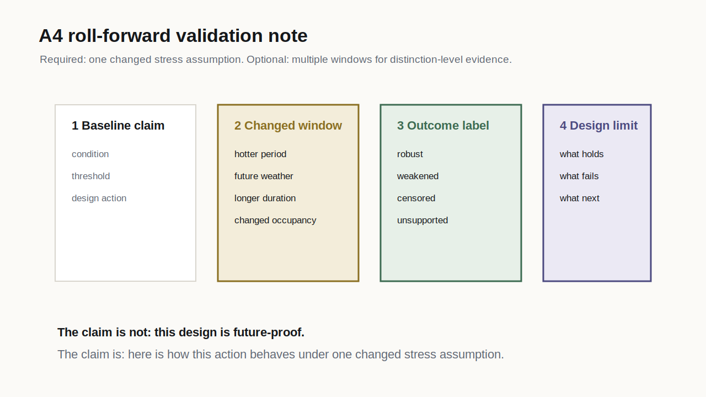

## Week Question

How do you defend a thermal action under changed climate or stress assumptions without overclaiming?

Week 11 adds the required A4 roll-forward validation note, uncertainty statement, and reproducibility capsule.

:::{.key}
The design action stays fixed. One stress assumption changes. The conclusion is tested for robustness.
:::

## Roll-Forward Validation

{fig-alt="Diagram showing a fixed design action tested against a changed stress window or climate assumption" width="82%"}

:::{.caption}
Roll-forward validation checks whether the A4 action remains defensible when the weather window, climate stress, or evaluation assumption changes.
:::

## Required A4 Version

Minimum roll-forward validation:

- keep the design action fixed
- change one stress assumption
- report whether the action is robust, weakened, censored, or unsupported
- state one future-proofing implication
- own one limitation honestly

Changed assumptions may include a hotter week, heatwave, future weather file, longer window, altered occupancy, changed ventilation availability, or changed indoor/outdoor boundary.

## Validation Window Change {.equation-card}

Baseline:

$$
B = (a^*, W_0, O_0, E_0)
$$

Roll-forward case:

$$
R = (a^*, W_1, O_0, E_0)
$$

Change in accumulated burden:

$$
\Delta DH_{\theta}
=
DH_{\theta}(R)
-
DH_{\theta}(B)
$$

The action $a^*$ stays fixed. The window changes from $W_0$ to $W_1$.

## More Than One Window

Distinction-level work may compare multiple windows:

$$
W_{3d} \subset W_{7d} \subset W_{14d}
$$

or:

$$
W_{typical}, \quad W_{hot}, \quad W_{heatwave}
$$

The point is not more computation. The point is to see whether the design conclusion survives a different slice of climate stress.

## Simple ML Analogy {.equation-card}

The analogy to cross-validation is limited but useful:

$$
\text{choose action on } W_{dev}:
\quad
a^* = f(W_{dev})
$$

$$
\text{test fixed action on } W_{holdout}:
\quad
DH_{\theta}(a^*, W_{holdout})
$$

In design terms: do not choose the action and judge it only on the same convenient weather window.

## Outcome Labels

| Label | Meaning |
|---|---|
| robust | action still meets or plausibly supports the target |
| weakened | action helps, but with reduced margin or residual burden |
| censored | action does not reach the target within tested assumptions |
| unsupported | evidence is insufficient to make a roll-forward claim |

:::{.caption}
Use labels to reduce ambiguity. Then explain the physical reason behind the label.
:::

## Uncertainty Statement

A rigorous uncertainty statement names limits without dissolving the claim.

Include:

- measurement uncertainty
- weather file or climate scenario uncertainty
- model input uncertainty
- threshold and occupant assumption
- variables not measured or simulated
- schedule or service-state assumptions
- out-of-support conditions

:::{.key}
Uncertainty is not an apology. It is the boundary of the claim.
:::

## Reproducibility Capsule

The A4 reproducibility capsule should let another person inspect the evidence path.

Minimum contents:

- source list
- data table or CSV
- notebook, workbook, script, or model file if used
- exported key figure
- rerun or inspection instructions
- known assumptions and limits

No hidden spreadsheet operations. No unlabeled scenario files. No final plot without the input route.

## Lab Activity: Roll-Forward Validation Card {.activity}

Test the selected A4 action against one changed stress assumption.

**Artifact:** a roll-forward validation card with baseline case, changed case, fixed action, changed assumption, degree-hour or failure-hour comparison, outcome label, future-proofing implication, and one limitation.

**A4 mapping:** this card is a required final deliverable. It proves the student can defend the design action under uncertainty rather than only under the original A3 window.

## Lab Activity: Uncertainty And Reproducibility Capsule {.activity}

Prepare the final evidence boundary.

**Artifact:** a one-page uncertainty statement plus a reproducibility checklist naming inputs, files, calculation route, exported figures, and known limits.

**A4 mapping:** this supports the oral defense and prevents the final design claim from exceeding the evidence.

## Session 2: Diagnostic Round

::: {.round-steps}
::: {.round-step}
**10 min - case scan.** Choose one A4 action and one changed assumption that could weaken it.
:::
::: {.round-step}
**5 min - Slack post.** Post the baseline design action and baseline claim. Keep the changed assumption hidden.
:::
::: {.round-step}
**20-25 min - round-table guesses.** Classmates guess which assumption should be changed for roll-forward validation and what outcome label may result.
:::
::: {.round-step}
**10-15 min - host reveal.** The host reveals the changed window or scenario, outcome label, future-proofing implication, and limit of claim.
:::
:::

## Week 11 Hint Level

::: {.hint-card minimal}
Minimal hints.

The strongest guess is not the most dramatic scenario. It is the changed assumption most likely to test the design claim honestly.
:::

## Defense Clinic

Use a five-minute mock defense:

1. condition
2. evidence
3. failure mode
4. design action
5. roll-forward outcome
6. uncertainty boundary
7. next test

Peers ask only questions that can be answered by pointing to a figure, table, drawing, equation, or declared limitation.

## Presenting Censored Results

If the roll-forward result is censored, present it clearly:

- target and threshold
- fixed action
- changed stress assumption
- remaining degree-hours or failure hours
- what intervention class would need to change next
- why the current action remains useful, insufficient, or rejected

:::{.key}
A censored roll-forward result can be a strong future-proofing finding if the remaining burden is visible.
:::

## Week 11 Exit Ticket {.checklist}

Before Week 12, each student should have:

- final A4 action
- final evidence figures from A1, A2, and A3
- design action ladder
- roll-forward validation card
- uncertainty statement
- reproducibility capsule
- five-minute jury sequence

Week 12 is the thermal design jury.
